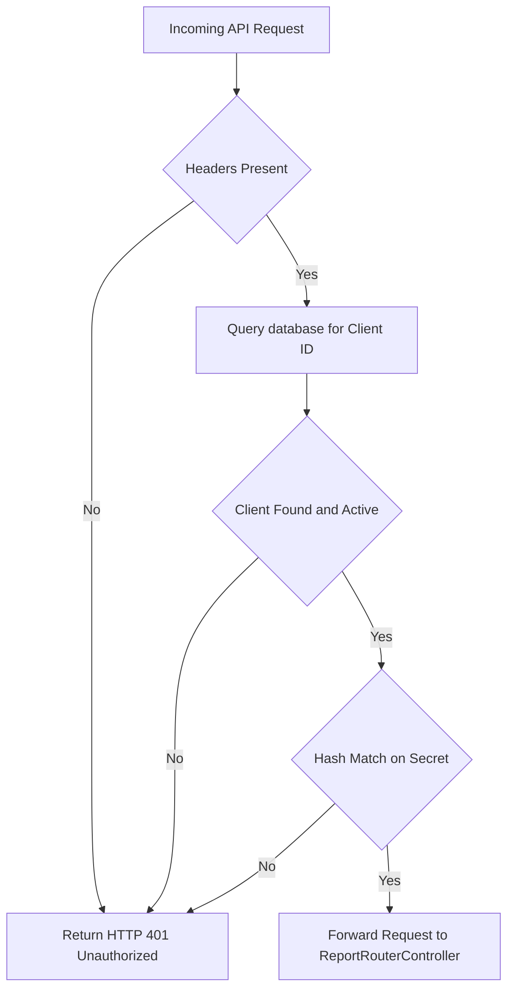
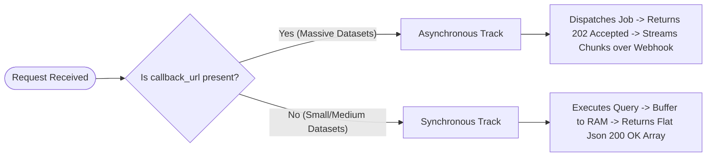
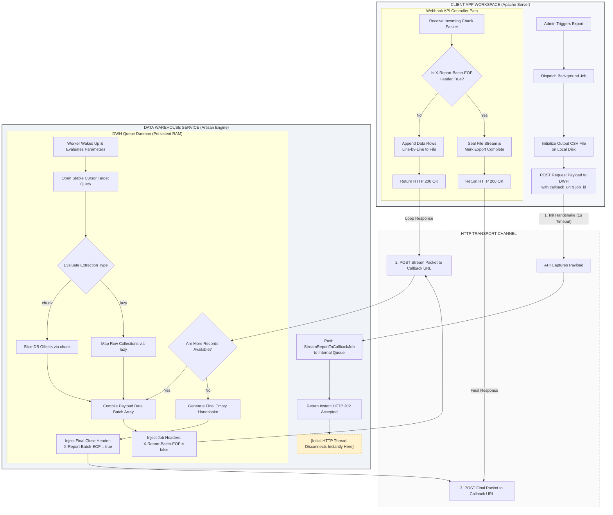

<style>
@media print {
    .mermaid, svg, pre, table {
        page-break-inside: avoid !important;
        break-inside: avoid !important;
    }
}
</style>
# Data Warehouse API Security & Transmission Architecture Documentation

## Executive Summary
This document provides a comprehensive technical overview of the security integration layer and data transmission patterns utilized between the **Source Application** and the **Data Warehouse (DWH) Service**.

It outlines the complete lifecycle of authentication—from consumer key creation to header payload injection—and details both structural reporting patterns: **Synchronous REST Array Extraction** and **Asynchronous HTTP Chunked Streaming**.

---

## 1. Authentication Layer & Consumer Integration

The DWH Service uses an explicit **Client Credentials Shared Secret** topography to protect reporting endpoints from unauthorized cross-network access.

### A. Database Storage Schema (DWH Side)
To register a consumer for access to DWH endpoints, an record is created inside the DWH `Dwh_Api_Consumers` table:

```sql
CREATE TABLE Dwh_Api_Consumers (
    id INT AUTO_INCREMENT PRIMARY KEY,
    client_name VARCHAR(100) NOT NULL,
    client_id VARCHAR(64) UNIQUE NOT NULL,
    api_secret_hash VARCHAR(255) NOT NULL,
    allowed_ips JSON,
    is_active TINYINT(1) DEFAULT 1,
    last_used_at TIMESTAMP,
    created_at TIMESTAMP DEFAULT CURRENT_TIMESTAMP,
    updated_at TIMESTAMP
);
```

B. Header Payload Injection Mapping
Every single request originating from the Source application must inject these generated credentials into the secure HTTP header transmission matrix.

```
┌────────────────────────────────────────┐
│      SOURCE APP PIPELINE HANDLER       │
│                                        │
│  Pulls from config/services.php:       │
│  - config('services.dwh.client_id')    │
│  - config('services.dwh.client_secret')│
└───────────────────┬────────────────────┘
                    │
                    │ Encapsulates HTTP Headers
                    ▼
┌────────────────────────────────────────┐
│           OUTBOUND HTTP POST           │
│                                        │
│  Headers:                              │
│  - X-DWH-Client-ID: [id_string]        │
│  - X-DWH-Client-Secret: [secret_hash]  │
│  - Accept: application/json            │
└────────────────────────────────────────┘
```
Client Configuration Entry (config/services.php)
```php
'dwh' => [
    'url'           => env('SERVICES_DWH_URL', '[https://dwh.local](https://dwh.local)'),
    'client_id'     => env('SERVICES_DWH_CLIENT_ID'),
    'client_secret' => env('SERVICES_DWH_CLIENT_SECRET'),
],
```

2. Request Authorization Flow Middleware (DWH Side)
An incoming request hit passes down into a strict middleware interceptor wrapper validation layer before hitting the core reporting controllers.


Middleware Implementation Sample (AuthorizeDwhConsumer.php)
```php
<?php

namespace App\Http\Middleware;

use Closure;
use Illuminate\Http\Request;
use Illuminate\Support\Facades\DB;
use Symfony\Component\HttpFoundation\Response;

class ValidateDwhConsumer
{
    public function handle(Request $request, Closure $next): Response
    {
        // Get credentials from secure Request Headers
        $clientId = $request->header('X-DWH-Client-ID');
        $clientSecret = $request->header('X-DWH-Client-Secret');

        if (!$clientId || !$clientSecret) {
            return response()->json([
                'success' => false,
                'message' => 'Access Denied: Missing authentication identity wrappers.'
            ], 401);
        }

        // Get the consumer profile from the DWH database
        $consumer = DB::connection('mysql')->table('Dwh_Api_Consumers')
            ->where('client_id', $clientId)
            ->where('is_active', 1)
            ->first();

        if (!$consumer) {
            return response()->json([
                'success' => false,
                'message' => 'Access Denied: Invalid or revoked Client Identifier.'
            ], 401);
        }

        // Crypto Validation Layer
        // Uses standard SHA-256 validation against the stored secure secret hash
        $incomingHash = hash('sha256', $clientSecret);
        if (!hash_equals($consumer->api_secret_hash, $incomingHash)) {
            return response()->json([
                'success' => false,
                'message' => 'Access Denied: Signature authentication failed.'
            ], 401);
        }

        // Network Security Layer (Application-Level IP Whitelisting)
        if (!empty($consumer->allowed_ips)) {
            $allowedIps = json_decode($consumer->allowed_ips, true) ?? [];
            $incomingIp = $request->ip();

            if (!in_array($incomingIp, $allowedIps)) {
                return response()->json([
                    'success' => false,
                    'message' => "Access Denied: Origin network address '{$incomingIp}' is not authorized."
                ], 403); // 403 Forbidden indicates auth passed but network layer blocked it
            }
        }

        // Audit Logging Trail: Log the successful hit timestamp asynchronously
        DB::connection('mysql')->table('Dwh_Api_Consumers')
            ->where('id', $consumer->id)
            ->update(['last_used_at' => now()]);

        return $next($request);
    }
}
```

3. Data Transmission Implementation Patterns
Once authorized, the system processes requests using one of two explicit architectural extraction patterns depending on the presence of a callback_url.



Pattern A: Synchronous REST Array Extraction (toArray())
Used primarily for smaller data aggregates or lightweight dashboard metrics (e.g., TpHandsUpSurveyHandler queries). The request blocks execution while the query evaluates, and the full payload is returned in the response.

1. Controller Routing Mechanics

```php
// If no callback_url is present, the Controller fires sequentially:
$reportData = $handler->execute($validatedParams);

return response()->json([
    'success'     => true,
    'report_key'  => $reportKey,
    'row_count'   => count($reportData),
    'data'        => $reportData // Full dataset array buffer written out inside JSON response
], 200);

```

2. Query Handler Layout

```php
public function execute(array $params): array
{
    //example
    $query = DB::connection('mysql')->table('Fact_HandsUp_Survey as f')
        ->select(['f.Exp_Enjoyed as Enjoyed', 'f.Exp_Did_Not_Enjoy as DidNotEnjoy']);
        
    // Standard execution footprint buffers everything into framework memory array collections
    return $query->get()->toArray(); 
}
```
Pros: Simple, immediate inline execution block.

Cons: High memory footprint for larger datasets. Vulnerable to browser/server HTTP gateway timeout loops if table row depths expand.

Pattern B: Asynchronous HTTP Chunked Streaming (Webhook Delivery)
Used for heavy operational extraction patterns (e.g., Deliveries data warehouse queries). This pattern isolates background jobs, chunks data queries to optimize memory, and feeds datasets directly to the consumer's webhooks.



1. Non-Blocking Handshake Initialization
The client fires a request with 'callback_url' provided in the DWH Api call. 
The DWH router captures the request, dispatches a processing job to its internal queue database, and drops out instantly with a 202 response code, clearing the initial network thread.

```php
if (!empty($callbackUrl)) {
    StreamReportToCallbackJob::dispatch($reportKey, $validatedParams, $callbackUrl, $jobId);

    return response()->json([
        'success'  => true,
        'status'   => 'accepted',
        'message'  => 'The report generation sequence has been safely deferred to background processing workers.'
    ], 202);
}
```

2. The Abstract Streaming Core (AbstractStreamingReportHandler)
To handle outbound data transmission consistently across different types of reports, all streaming handlers extend a unified base class. This base class encapsulates environment normalization rules, manages target secure ports, and dynamically injects SSL context flags based on the environment configuration.

```php
<?php

namespace App\Reports\Handlers;

use App\Reports\Contracts\ReportHandlerInterface;
use Illuminate\Support\Facades\Http;
use Illuminate\Support\Facades\Log;

abstract class AbstractStreamingReportHandler implements ReportHandlerInterface
{
    protected ?string $callbackUrl = null;
    protected ?string $jobId = null;

    public function setAsyncProperties(string $callbackUrl, ?string $jobId): void
    {
        $this->callbackUrl = $callbackUrl;
        $this->jobId       = $jobId;
    }

    /**
     * Local Environment Normalization Bypass Rule
     * Forces HTTP over to HTTPS to ensure local Mac workers hit Apache Port 443 VirtualHosts cleanly.
     */
    protected function getNormalizedCallbackUrl(): string
    {
        $url = $this->callbackUrl;
        if (app()->environment('local') && !empty($url)) {
            $url = str_replace('http://', 'https://', $url);
        }
        return $url;
    }

    /**
     * Centralized network sender. Handles conditional SSL verification checks dynamically.
     */
    protected function transmitBatch(array $payload, bool $isFinal): void
    {
        if (empty($payload) && !$isFinal) return;

        $url = $this->getNormalizedCallbackUrl();
        
        $guzzleHeaders = [
            'X-Report-Job-ID'    => $this->jobId ?? '0',
            'X-Report-Batch-EOF' => $isFinal ? 'true' : 'false',
            'Accept'             => 'application/json'
        ];

        // Conditional SSL Guarding: Disable only for local sandbox testing steps
        $shouldVerifySsl = !app()->environment(['local', 'dev', 'development']);

        $response = Http::withOptions(['verify' => $shouldVerifySsl])
            ->withHeaders($guzzleHeaders)
            ->post($url, ['data' => $payload]);

        if ($response->failed()) {
            Log::error("DWH Streamer: Network call dropped. Status: " . $response->status());
            throw new \Exception("Data stream delivery failed during chunk execution loop.");
        }
    }
}
```

3. Concrete Streaming Implementations
Concrete classes choose the query streaming style that best fits their datasets: either database-level window pagination chunks or memory-friendly cursor row loops.

Option 1: Database Window Chunking (e.g., DeliveriesHandler)
Best for high-volume datasets with simple table structures. This approach relies on the database engine to segment records into sequential blocks.

```php
public function execute(array $params): array
{
    if (empty($this->callbackUrl)) {
        return $this->buildQuery($params)->get()->toArray();
    }

    // Stream Database Pagination Windows
    $this->buildQuery($params)->chunk(1000, function ($rows) {
        $chunkArray = $rows->map(fn($row) => (array)$row)->toArray();
        $this->transmitBatch($chunkArray, false);
    });

    // Send final empty payload with the EOF completion header flag 🏁
    $this->transmitBatch([], true);
    return ['status' => 'async_completed'];
}
```

Option 2: Continuous Row-by-Row Cursor Caching (e.g., PreCourseCycleFrequencyHandler)
Best for datasets that require advanced, row-by-row data transformation or localization mappings. This approach keeps a single cursor reference open to stream records efficiently without straining server RAM.

```PHP
public function execute(array $params): array
{
    $query = $this->buildQuery($params);

    if (empty($this->callbackUrl)) {
        return $query->get()->toArray();
    }

    // Stream continuous data points via Lazy evaluation cursors
    $records = $query->lazy();
    $batch = [];
    
    foreach ($records as $row) {
        $batch[] = [
            'grant_number'   => $row->Grant_Number,
            'freq_leisure'   => $this->translateFreq($row->Pre_Freq_Leisure), // Complex local string translation
        ];

        if (count($batch) >= 5000) {
            $this->transmitBatch($batch, false);
            $batch = [];
        }
    }

    // Finalize the stream and push the final EOF signal 🏁
    $this->transmitBatch($batch, true);
    return ['status' => 'async_completed'];
}
```
Pros: Highly scalable. Keeps server memory usage low and predictable, entirely eliminating script execution timeouts.

Cons: Requires active, dedicated background queue processors (php artisan queue:work) to run concurrently on both systems.
