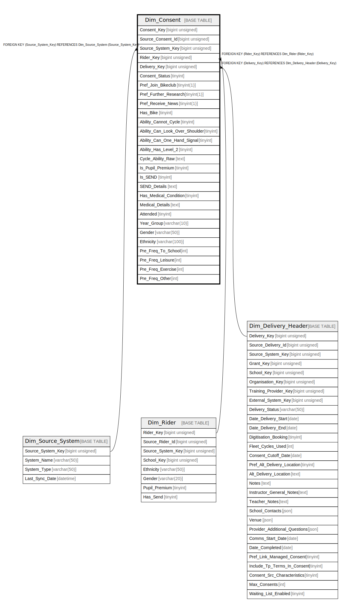

# Dim_Consent

## Description

<details>
<summary><strong>Table Definition</strong></summary>

```sql
CREATE TABLE `Dim_Consent` (
  `Consent_Key` bigint unsigned NOT NULL AUTO_INCREMENT,
  `Source_Consent_Id` bigint unsigned NOT NULL,
  `Source_System_Key` bigint unsigned NOT NULL,
  `Rider_Key` bigint unsigned NOT NULL,
  `Delivery_Key` bigint unsigned NOT NULL,
  `Consent_Status` tinyint DEFAULT NULL,
  `Pref_Join_Bikeclub` tinyint(1) NOT NULL DEFAULT '0',
  `Pref_Further_Research` tinyint(1) NOT NULL DEFAULT '0',
  `Pref_Receive_News` tinyint(1) NOT NULL DEFAULT '0',
  `Has_Bike` tinyint DEFAULT NULL,
  `Ability_Cannot_Cycle` tinyint NOT NULL DEFAULT '0' COMMENT '1: My child cannot yet cycle',
  `Ability_Can_Look_Over_Shoulder` tinyint NOT NULL DEFAULT '0' COMMENT '2: Can look over shoulder',
  `Ability_Can_One_Hand_Signal` tinyint NOT NULL DEFAULT '0' COMMENT '3: Can signal with one hand',
  `Ability_Has_Level_2` tinyint NOT NULL DEFAULT '0' COMMENT '4: Already completed Level 2',
  `Cycle_Ability_Raw` text CHARACTER SET utf8mb4 COLLATE utf8mb4_unicode_ci,
  `Is_Pupil_Premium` tinyint DEFAULT NULL,
  `Is_SEND` tinyint DEFAULT NULL,
  `SEND_Details` text CHARACTER SET utf8mb4 COLLATE utf8mb4_unicode_ci,
  `Has_Medical_Condition` tinyint DEFAULT NULL,
  `Medical_Details` text CHARACTER SET utf8mb4 COLLATE utf8mb4_unicode_ci,
  `Attended` tinyint NOT NULL DEFAULT '1',
  `Year_Group` varchar(10) CHARACTER SET utf8mb4 COLLATE utf8mb4_unicode_ci DEFAULT NULL,
  `Gender` varchar(50) CHARACTER SET utf8mb4 COLLATE utf8mb4_unicode_ci DEFAULT NULL,
  `Ethnicity` varchar(100) CHARACTER SET utf8mb4 COLLATE utf8mb4_unicode_ci DEFAULT NULL,
  `Pre_Freq_To_School` int DEFAULT NULL,
  `Pre_Freq_Leisure` int DEFAULT NULL,
  `Pre_Freq_Exercise` int DEFAULT NULL,
  `Pre_Freq_Other` int DEFAULT NULL,
  PRIMARY KEY (`Consent_Key`),
  KEY `dim_consent_source_system_key_foreign` (`Source_System_Key`),
  KEY `dim_consent_rider_key_foreign` (`Rider_Key`),
  KEY `dim_consent_delivery_key_foreign` (`Delivery_Key`),
  KEY `idx_consent_source` (`Source_Consent_Id`),
  CONSTRAINT `dim_consent_delivery_key_foreign` FOREIGN KEY (`Delivery_Key`) REFERENCES `Dim_Delivery_Header` (`Delivery_Key`),
  CONSTRAINT `dim_consent_rider_key_foreign` FOREIGN KEY (`Rider_Key`) REFERENCES `Dim_Rider` (`Rider_Key`),
  CONSTRAINT `dim_consent_source_system_key_foreign` FOREIGN KEY (`Source_System_Key`) REFERENCES `Dim_Source_System` (`Source_System_Key`)
) ENGINE=InnoDB AUTO_INCREMENT=[Redacted by tbls] DEFAULT CHARSET=utf8mb4 COLLATE=utf8mb4_unicode_ci
```

</details>

## Columns

| Name | Type | Default | Nullable | Extra Definition | Children | Parents | Comment |
| ---- | ---- | ------- | -------- | ---------------- | -------- | ------- | ------- |
| Consent_Key | bigint unsigned |  | false | auto_increment |  |  |  |
| Source_Consent_Id | bigint unsigned |  | false |  |  |  |  |
| Source_System_Key | bigint unsigned |  | false |  |  | [Dim_Source_System](Dim_Source_System.md) |  |
| Rider_Key | bigint unsigned |  | false |  |  | [Dim_Rider](Dim_Rider.md) |  |
| Delivery_Key | bigint unsigned |  | false |  |  | [Dim_Delivery_Header](Dim_Delivery_Header.md) |  |
| Consent_Status | tinyint |  | true |  |  |  |  |
| Pref_Join_Bikeclub | tinyint(1) | 0 | false |  |  |  |  |
| Pref_Further_Research | tinyint(1) | 0 | false |  |  |  |  |
| Pref_Receive_News | tinyint(1) | 0 | false |  |  |  |  |
| Has_Bike | tinyint |  | true |  |  |  |  |
| Ability_Cannot_Cycle | tinyint | 0 | false |  |  |  | 1: My child cannot yet cycle |
| Ability_Can_Look_Over_Shoulder | tinyint | 0 | false |  |  |  | 2: Can look over shoulder |
| Ability_Can_One_Hand_Signal | tinyint | 0 | false |  |  |  | 3: Can signal with one hand |
| Ability_Has_Level_2 | tinyint | 0 | false |  |  |  | 4: Already completed Level 2 |
| Cycle_Ability_Raw | text |  | true |  |  |  |  |
| Is_Pupil_Premium | tinyint |  | true |  |  |  |  |
| Is_SEND | tinyint |  | true |  |  |  |  |
| SEND_Details | text |  | true |  |  |  |  |
| Has_Medical_Condition | tinyint |  | true |  |  |  |  |
| Medical_Details | text |  | true |  |  |  |  |
| Attended | tinyint | 1 | false |  |  |  |  |
| Year_Group | varchar(10) |  | true |  |  |  |  |
| Gender | varchar(50) |  | true |  |  |  |  |
| Ethnicity | varchar(100) |  | true |  |  |  |  |
| Pre_Freq_To_School | int |  | true |  |  |  |  |
| Pre_Freq_Leisure | int |  | true |  |  |  |  |
| Pre_Freq_Exercise | int |  | true |  |  |  |  |
| Pre_Freq_Other | int |  | true |  |  |  |  |

## Constraints

| Name | Type | Definition |
| ---- | ---- | ---------- |
| dim_consent_delivery_key_foreign | FOREIGN KEY | FOREIGN KEY (Delivery_Key) REFERENCES Dim_Delivery_Header (Delivery_Key) |
| dim_consent_rider_key_foreign | FOREIGN KEY | FOREIGN KEY (Rider_Key) REFERENCES Dim_Rider (Rider_Key) |
| dim_consent_source_system_key_foreign | FOREIGN KEY | FOREIGN KEY (Source_System_Key) REFERENCES Dim_Source_System (Source_System_Key) |
| PRIMARY | PRIMARY KEY | PRIMARY KEY (Consent_Key) |

## Indexes

| Name | Definition |
| ---- | ---------- |
| dim_consent_delivery_key_foreign | KEY dim_consent_delivery_key_foreign (Delivery_Key) USING BTREE |
| dim_consent_rider_key_foreign | KEY dim_consent_rider_key_foreign (Rider_Key) USING BTREE |
| dim_consent_source_system_key_foreign | KEY dim_consent_source_system_key_foreign (Source_System_Key) USING BTREE |
| idx_consent_source | KEY idx_consent_source (Source_Consent_Id) USING BTREE |
| PRIMARY | PRIMARY KEY (Consent_Key) USING BTREE |

## Relations



---

> Generated by [tbls](https://github.com/k1LoW/tbls)
