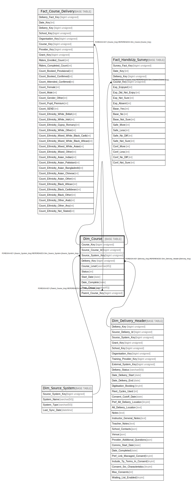

# Dim_Course

## Description

<details>
<summary><strong>Table Definition</strong></summary>

```sql
CREATE TABLE `Dim_Course` (
  `Course_Key` bigint unsigned NOT NULL AUTO_INCREMENT,
  `Source_Course_Id` bigint unsigned NOT NULL,
  `Source_System_Key` bigint unsigned NOT NULL,
  `Delivery_Key` bigint unsigned NOT NULL,
  `Course_Level` varchar(45) CHARACTER SET utf8mb4 COLLATE utf8mb4_unicode_ci NOT NULL,
  `Status` int DEFAULT NULL,
  `Start_Date` date DEFAULT NULL,
  `Date_Complete` date DEFAULT NULL,
  `Year_Group` varchar(45) CHARACTER SET utf8mb4 COLLATE utf8mb4_unicode_ci DEFAULT NULL,
  `Parent_Course_Key` bigint unsigned DEFAULT NULL,
  PRIMARY KEY (`Course_Key`),
  KEY `dim_course_source_system_key_foreign` (`Source_System_Key`),
  KEY `dim_course_delivery_key_foreign` (`Delivery_Key`),
  KEY `dim_course_parent_course_key_foreign` (`Parent_Course_Key`),
  KEY `idx_course_source` (`Source_Course_Id`,`Source_System_Key`),
  CONSTRAINT `dim_course_delivery_key_foreign` FOREIGN KEY (`Delivery_Key`) REFERENCES `Dim_Delivery_Header` (`Delivery_Key`),
  CONSTRAINT `dim_course_parent_course_key_foreign` FOREIGN KEY (`Parent_Course_Key`) REFERENCES `Dim_Course` (`Course_Key`) ON DELETE SET NULL,
  CONSTRAINT `dim_course_source_system_key_foreign` FOREIGN KEY (`Source_System_Key`) REFERENCES `Dim_Source_System` (`Source_System_Key`)
) ENGINE=InnoDB AUTO_INCREMENT=[Redacted by tbls] DEFAULT CHARSET=utf8mb4 COLLATE=utf8mb4_unicode_ci
```

</details>

## Columns

| Name | Type | Default | Nullable | Extra Definition | Children | Parents | Comment |
| ---- | ---- | ------- | -------- | ---------------- | -------- | ------- | ------- |
| Course_Key | bigint unsigned |  | false | auto_increment | [Dim_Course](Dim_Course.md) [Fact_Course_Delivery](Fact_Course_Delivery.md) [Fact_HandsUp_Survey](Fact_HandsUp_Survey.md) |  |  |
| Source_Course_Id | bigint unsigned |  | false |  |  |  |  |
| Source_System_Key | bigint unsigned |  | false |  |  | [Dim_Source_System](Dim_Source_System.md) |  |
| Delivery_Key | bigint unsigned |  | false |  |  | [Dim_Delivery_Header](Dim_Delivery_Header.md) |  |
| Course_Level | varchar(45) |  | false |  |  |  |  |
| Status | int |  | true |  |  |  |  |
| Start_Date | date |  | true |  |  |  |  |
| Date_Complete | date |  | true |  |  |  |  |
| Year_Group | varchar(45) |  | true |  |  |  |  |
| Parent_Course_Key | bigint unsigned |  | true |  |  | [Dim_Course](Dim_Course.md) |  |

## Constraints

| Name | Type | Definition |
| ---- | ---- | ---------- |
| dim_course_delivery_key_foreign | FOREIGN KEY | FOREIGN KEY (Delivery_Key) REFERENCES Dim_Delivery_Header (Delivery_Key) |
| dim_course_parent_course_key_foreign | FOREIGN KEY | FOREIGN KEY (Parent_Course_Key) REFERENCES Dim_Course (Course_Key) |
| dim_course_source_system_key_foreign | FOREIGN KEY | FOREIGN KEY (Source_System_Key) REFERENCES Dim_Source_System (Source_System_Key) |
| PRIMARY | PRIMARY KEY | PRIMARY KEY (Course_Key) |

## Indexes

| Name | Definition |
| ---- | ---------- |
| dim_course_delivery_key_foreign | KEY dim_course_delivery_key_foreign (Delivery_Key) USING BTREE |
| dim_course_parent_course_key_foreign | KEY dim_course_parent_course_key_foreign (Parent_Course_Key) USING BTREE |
| dim_course_source_system_key_foreign | KEY dim_course_source_system_key_foreign (Source_System_Key) USING BTREE |
| idx_course_source | KEY idx_course_source (Source_Course_Id, Source_System_Key) USING BTREE |
| PRIMARY | PRIMARY KEY (Course_Key) USING BTREE |

## Relations



---

> Generated by [tbls](https://github.com/k1LoW/tbls)
