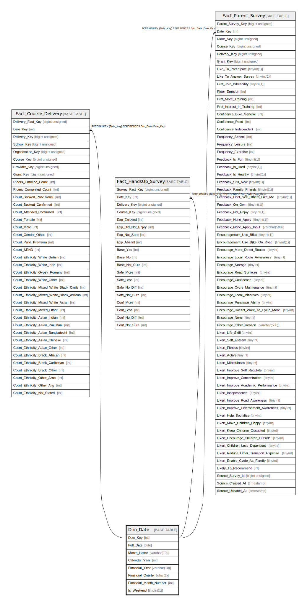

# Dim_Date

## Description

<details>
<summary><strong>Table Definition</strong></summary>

```sql
CREATE TABLE `Dim_Date` (
  `Date_Key` int NOT NULL,
  `Full_Date` date NOT NULL,
  `Month_Name` varchar(10) CHARACTER SET utf8mb4 COLLATE utf8mb4_unicode_ci NOT NULL,
  `Calendar_Year` int NOT NULL,
  `Financial_Year` varchar(10) CHARACTER SET utf8mb4 COLLATE utf8mb4_unicode_ci NOT NULL,
  `Financial_Quarter` char(2) CHARACTER SET utf8mb4 COLLATE utf8mb4_unicode_ci NOT NULL,
  `Financial_Month_Number` int NOT NULL,
  `Is_Weekend` tinyint(1) NOT NULL,
  PRIMARY KEY (`Date_Key`),
  UNIQUE KEY `dim_date_full_date_unique` (`Full_Date`)
) ENGINE=InnoDB DEFAULT CHARSET=utf8mb4 COLLATE=utf8mb4_unicode_ci
```

</details>

## Columns

| Name | Type | Default | Nullable | Children | Parents | Comment |
| ---- | ---- | ------- | -------- | -------- | ------- | ------- |
| Date_Key | int |  | false | [Fact_Course_Delivery](Fact_Course_Delivery.md) [Fact_HandsUp_Survey](Fact_HandsUp_Survey.md) [Fact_Parent_Survey](Fact_Parent_Survey.md) |  |  |
| Full_Date | date |  | false |  |  |  |
| Month_Name | varchar(10) |  | false |  |  |  |
| Calendar_Year | int |  | false |  |  |  |
| Financial_Year | varchar(10) |  | false |  |  |  |
| Financial_Quarter | char(2) |  | false |  |  |  |
| Financial_Month_Number | int |  | false |  |  |  |
| Is_Weekend | tinyint(1) |  | false |  |  |  |

## Constraints

| Name | Type | Definition |
| ---- | ---- | ---------- |
| dim_date_full_date_unique | UNIQUE | UNIQUE KEY dim_date_full_date_unique (Full_Date) |
| PRIMARY | PRIMARY KEY | PRIMARY KEY (Date_Key) |

## Indexes

| Name | Definition |
| ---- | ---------- |
| PRIMARY | PRIMARY KEY (Date_Key) USING BTREE |
| dim_date_full_date_unique | UNIQUE KEY dim_date_full_date_unique (Full_Date) USING BTREE |

## Relations



---

> Generated by [tbls](https://github.com/k1LoW/tbls)
