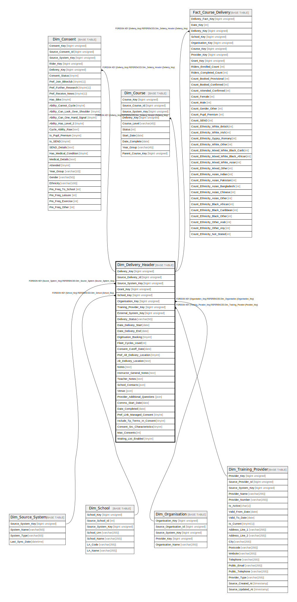

# Dim_Delivery_Header

## Description

<details>
<summary><strong>Table Definition</strong></summary>

```sql
CREATE TABLE `Dim_Delivery_Header` (
  `Delivery_Key` bigint unsigned NOT NULL AUTO_INCREMENT,
  `Source_Delivery_Id` bigint unsigned NOT NULL,
  `Source_System_Key` bigint unsigned NOT NULL,
  `Grant_Key` bigint unsigned DEFAULT NULL,
  `School_Key` bigint unsigned DEFAULT NULL,
  `Organisation_Key` bigint unsigned DEFAULT NULL,
  `Training_Provider_Key` bigint unsigned DEFAULT NULL,
  `External_System_Key` bigint unsigned DEFAULT NULL,
  `Delivery_Status` varchar(50) CHARACTER SET utf8mb4 COLLATE utf8mb4_unicode_ci NOT NULL,
  `Date_Delivery_Start` date DEFAULT NULL,
  `Date_Delivery_End` date DEFAULT NULL,
  `Digitisation_Booking` tinyint NOT NULL DEFAULT '0',
  `Fleet_Cycles_Used` int DEFAULT '0',
  `Consent_Cutoff_Date` date DEFAULT NULL,
  `Pref_Alt_Delivery_Location` tinyint NOT NULL DEFAULT '0',
  `Alt_Delivery_Location` text COLLATE utf8mb4_unicode_ci,
  `Notes` text COLLATE utf8mb4_unicode_ci,
  `Instructor_General_Notes` text COLLATE utf8mb4_unicode_ci,
  `Teacher_Notes` text COLLATE utf8mb4_unicode_ci,
  `School_Contacts` json DEFAULT NULL,
  `Venue` json DEFAULT NULL,
  `Provider_Additional_Questions` json DEFAULT NULL,
  `Comms_Start_Date` date DEFAULT NULL,
  `Date_Completed` date DEFAULT NULL,
  `Pref_Link_Managed_Consent` tinyint DEFAULT NULL,
  `Include_Tp_Terms_In_Consent` tinyint NOT NULL DEFAULT '0',
  `Consent_Src_Characteristics` tinyint NOT NULL DEFAULT '0',
  `Max_Consents` int DEFAULT NULL,
  `Waiting_List_Enabled` tinyint NOT NULL DEFAULT '0',
  PRIMARY KEY (`Delivery_Key`),
  KEY `dim_delivery_header_source_system_key_foreign` (`Source_System_Key`),
  KEY `dim_delivery_header_school_key_foreign` (`School_Key`),
  KEY `dim_delivery_header_organisation_key_foreign` (`Organisation_Key`),
  KEY `dim_delivery_header_training_provider_key_foreign` (`Training_Provider_Key`),
  CONSTRAINT `dim_delivery_header_organisation_key_foreign` FOREIGN KEY (`Organisation_Key`) REFERENCES `Dim_Organisation` (`Organisation_Key`),
  CONSTRAINT `dim_delivery_header_school_key_foreign` FOREIGN KEY (`School_Key`) REFERENCES `Dim_School` (`School_Key`),
  CONSTRAINT `dim_delivery_header_source_system_key_foreign` FOREIGN KEY (`Source_System_Key`) REFERENCES `Dim_Source_System` (`Source_System_Key`),
  CONSTRAINT `dim_delivery_header_training_provider_key_foreign` FOREIGN KEY (`Training_Provider_Key`) REFERENCES `Dim_Training_Provider` (`Provider_Key`)
) ENGINE=InnoDB AUTO_INCREMENT=[Redacted by tbls] DEFAULT CHARSET=utf8mb4 COLLATE=utf8mb4_unicode_ci
```

</details>

## Columns

| Name | Type | Default | Nullable | Extra Definition | Children | Parents | Comment |
| ---- | ---- | ------- | -------- | ---------------- | -------- | ------- | ------- |
| Delivery_Key | bigint unsigned |  | false | auto_increment | [Dim_Consent](Dim_Consent.md) [Dim_Course](Dim_Course.md) [Fact_Course_Delivery](Fact_Course_Delivery.md) |  |  |
| Source_Delivery_Id | bigint unsigned |  | false |  |  |  |  |
| Source_System_Key | bigint unsigned |  | false |  |  | [Dim_Source_System](Dim_Source_System.md) |  |
| Grant_Key | bigint unsigned |  | true |  |  |  |  |
| School_Key | bigint unsigned |  | true |  |  | [Dim_School](Dim_School.md) |  |
| Organisation_Key | bigint unsigned |  | true |  |  | [Dim_Organisation](Dim_Organisation.md) |  |
| Training_Provider_Key | bigint unsigned |  | true |  |  | [Dim_Training_Provider](Dim_Training_Provider.md) |  |
| External_System_Key | bigint unsigned |  | true |  |  |  |  |
| Delivery_Status | varchar(50) |  | false |  |  |  |  |
| Date_Delivery_Start | date |  | true |  |  |  |  |
| Date_Delivery_End | date |  | true |  |  |  |  |
| Digitisation_Booking | tinyint | 0 | false |  |  |  |  |
| Fleet_Cycles_Used | int | 0 | true |  |  |  |  |
| Consent_Cutoff_Date | date |  | true |  |  |  |  |
| Pref_Alt_Delivery_Location | tinyint | 0 | false |  |  |  |  |
| Alt_Delivery_Location | text |  | true |  |  |  |  |
| Notes | text |  | true |  |  |  |  |
| Instructor_General_Notes | text |  | true |  |  |  |  |
| Teacher_Notes | text |  | true |  |  |  |  |
| School_Contacts | json |  | true |  |  |  |  |
| Venue | json |  | true |  |  |  |  |
| Provider_Additional_Questions | json |  | true |  |  |  |  |
| Comms_Start_Date | date |  | true |  |  |  |  |
| Date_Completed | date |  | true |  |  |  |  |
| Pref_Link_Managed_Consent | tinyint |  | true |  |  |  |  |
| Include_Tp_Terms_In_Consent | tinyint | 0 | false |  |  |  |  |
| Consent_Src_Characteristics | tinyint | 0 | false |  |  |  |  |
| Max_Consents | int |  | true |  |  |  |  |
| Waiting_List_Enabled | tinyint | 0 | false |  |  |  |  |

## Constraints

| Name | Type | Definition |
| ---- | ---- | ---------- |
| dim_delivery_header_organisation_key_foreign | FOREIGN KEY | FOREIGN KEY (Organisation_Key) REFERENCES Dim_Organisation (Organisation_Key) |
| dim_delivery_header_school_key_foreign | FOREIGN KEY | FOREIGN KEY (School_Key) REFERENCES Dim_School (School_Key) |
| dim_delivery_header_source_system_key_foreign | FOREIGN KEY | FOREIGN KEY (Source_System_Key) REFERENCES Dim_Source_System (Source_System_Key) |
| dim_delivery_header_training_provider_key_foreign | FOREIGN KEY | FOREIGN KEY (Training_Provider_Key) REFERENCES Dim_Training_Provider (Provider_Key) |
| PRIMARY | PRIMARY KEY | PRIMARY KEY (Delivery_Key) |

## Indexes

| Name | Definition |
| ---- | ---------- |
| dim_delivery_header_organisation_key_foreign | KEY dim_delivery_header_organisation_key_foreign (Organisation_Key) USING BTREE |
| dim_delivery_header_school_key_foreign | KEY dim_delivery_header_school_key_foreign (School_Key) USING BTREE |
| dim_delivery_header_source_system_key_foreign | KEY dim_delivery_header_source_system_key_foreign (Source_System_Key) USING BTREE |
| dim_delivery_header_training_provider_key_foreign | KEY dim_delivery_header_training_provider_key_foreign (Training_Provider_Key) USING BTREE |
| PRIMARY | PRIMARY KEY (Delivery_Key) USING BTREE |

## Relations



---

> Generated by [tbls](https://github.com/k1LoW/tbls)
