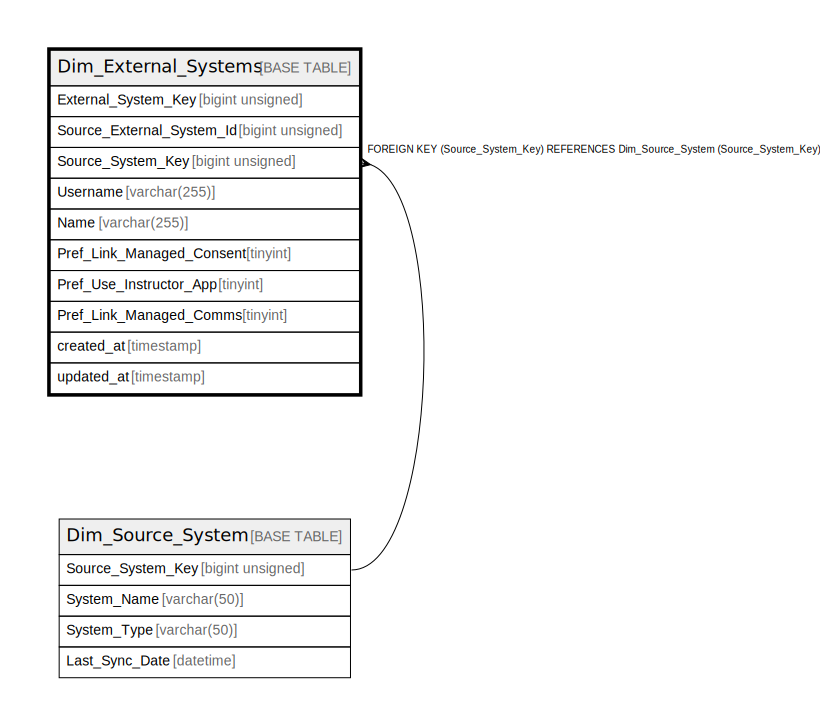

# Dim_External_Systems

## Description

<details>
<summary><strong>Table Definition</strong></summary>

```sql
CREATE TABLE `Dim_External_Systems` (
  `External_System_Key` bigint unsigned NOT NULL AUTO_INCREMENT,
  `Source_External_System_Id` bigint unsigned NOT NULL,
  `Source_System_Key` bigint unsigned NOT NULL,
  `Username` varchar(255) COLLATE utf8mb4_unicode_ci NOT NULL,
  `Name` varchar(255) COLLATE utf8mb4_unicode_ci DEFAULT NULL,
  `Pref_Link_Managed_Consent` tinyint NOT NULL DEFAULT '0',
  `Pref_Use_Instructor_App` tinyint NOT NULL DEFAULT '0',
  `Pref_Link_Managed_Comms` tinyint NOT NULL DEFAULT '0',
  `created_at` timestamp NULL DEFAULT NULL,
  `updated_at` timestamp NULL DEFAULT NULL,
  PRIMARY KEY (`External_System_Key`),
  UNIQUE KEY `dim_external_systems_source_external_system_id_unique` (`Source_External_System_Id`),
  KEY `dim_external_systems_source_system_key_foreign` (`Source_System_Key`),
  CONSTRAINT `dim_external_systems_source_system_key_foreign` FOREIGN KEY (`Source_System_Key`) REFERENCES `Dim_Source_System` (`Source_System_Key`)
) ENGINE=InnoDB AUTO_INCREMENT=[Redacted by tbls] DEFAULT CHARSET=utf8mb4 COLLATE=utf8mb4_unicode_ci
```

</details>

## Columns

| Name | Type | Default | Nullable | Extra Definition | Children | Parents | Comment |
| ---- | ---- | ------- | -------- | ---------------- | -------- | ------- | ------- |
| External_System_Key | bigint unsigned |  | false | auto_increment |  |  |  |
| Source_External_System_Id | bigint unsigned |  | false |  |  |  |  |
| Source_System_Key | bigint unsigned |  | false |  |  | [Dim_Source_System](Dim_Source_System.md) |  |
| Username | varchar(255) |  | false |  |  |  |  |
| Name | varchar(255) |  | true |  |  |  |  |
| Pref_Link_Managed_Consent | tinyint | 0 | false |  |  |  |  |
| Pref_Use_Instructor_App | tinyint | 0 | false |  |  |  |  |
| Pref_Link_Managed_Comms | tinyint | 0 | false |  |  |  |  |
| created_at | timestamp |  | true |  |  |  |  |
| updated_at | timestamp |  | true |  |  |  |  |

## Constraints

| Name | Type | Definition |
| ---- | ---- | ---------- |
| dim_external_systems_source_external_system_id_unique | UNIQUE | UNIQUE KEY dim_external_systems_source_external_system_id_unique (Source_External_System_Id) |
| dim_external_systems_source_system_key_foreign | FOREIGN KEY | FOREIGN KEY (Source_System_Key) REFERENCES Dim_Source_System (Source_System_Key) |
| PRIMARY | PRIMARY KEY | PRIMARY KEY (External_System_Key) |

## Indexes

| Name | Definition |
| ---- | ---------- |
| dim_external_systems_source_system_key_foreign | KEY dim_external_systems_source_system_key_foreign (Source_System_Key) USING BTREE |
| PRIMARY | PRIMARY KEY (External_System_Key) USING BTREE |
| dim_external_systems_source_external_system_id_unique | UNIQUE KEY dim_external_systems_source_external_system_id_unique (Source_External_System_Id) USING BTREE |

## Relations



---

> Generated by [tbls](https://github.com/k1LoW/tbls)
