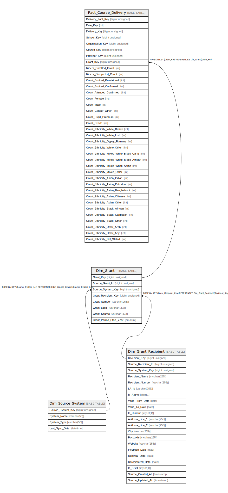

# Dim_Grant

## Description

<details>
<summary><strong>Table Definition</strong></summary>

```sql
CREATE TABLE `Dim_Grant` (
  `Grant_Key` bigint unsigned NOT NULL AUTO_INCREMENT,
  `Source_Grant_Id` bigint unsigned NOT NULL,
  `Source_System_Key` bigint unsigned NOT NULL,
  `Grant_Recipient_Key` bigint unsigned NOT NULL,
  `Grant_Number` varchar(255) CHARACTER SET utf8mb4 COLLATE utf8mb4_unicode_ci NOT NULL,
  `Grant_Label` varchar(255) CHARACTER SET utf8mb4 COLLATE utf8mb4_unicode_ci DEFAULT NULL,
  `Grant_Source` varchar(255) CHARACTER SET utf8mb4 COLLATE utf8mb4_unicode_ci DEFAULT NULL,
  `Grant_Period_Start_Year` smallint NOT NULL,
  PRIMARY KEY (`Grant_Key`),
  KEY `dim_grant_source_system_key_foreign` (`Source_System_Key`),
  KEY `dim_grant_grant_recipient_key_foreign` (`Grant_Recipient_Key`),
  KEY `idx_grant_source` (`Source_Grant_Id`,`Source_System_Key`),
  CONSTRAINT `dim_grant_grant_recipient_key_foreign` FOREIGN KEY (`Grant_Recipient_Key`) REFERENCES `Dim_Grant_Recipient` (`Recipient_Key`),
  CONSTRAINT `dim_grant_source_system_key_foreign` FOREIGN KEY (`Source_System_Key`) REFERENCES `Dim_Source_System` (`Source_System_Key`)
) ENGINE=InnoDB AUTO_INCREMENT=[Redacted by tbls] DEFAULT CHARSET=utf8mb4 COLLATE=utf8mb4_unicode_ci
```

</details>

## Columns

| Name | Type | Default | Nullable | Extra Definition | Children | Parents | Comment |
| ---- | ---- | ------- | -------- | ---------------- | -------- | ------- | ------- |
| Grant_Key | bigint unsigned |  | false | auto_increment | [Fact_Course_Delivery](Fact_Course_Delivery.md) |  |  |
| Source_Grant_Id | bigint unsigned |  | false |  |  |  |  |
| Source_System_Key | bigint unsigned |  | false |  |  | [Dim_Source_System](Dim_Source_System.md) |  |
| Grant_Recipient_Key | bigint unsigned |  | false |  |  | [Dim_Grant_Recipient](Dim_Grant_Recipient.md) |  |
| Grant_Number | varchar(255) |  | false |  |  |  |  |
| Grant_Label | varchar(255) |  | true |  |  |  |  |
| Grant_Source | varchar(255) |  | true |  |  |  |  |
| Grant_Period_Start_Year | smallint |  | false |  |  |  |  |

## Constraints

| Name | Type | Definition |
| ---- | ---- | ---------- |
| dim_grant_grant_recipient_key_foreign | FOREIGN KEY | FOREIGN KEY (Grant_Recipient_Key) REFERENCES Dim_Grant_Recipient (Recipient_Key) |
| dim_grant_source_system_key_foreign | FOREIGN KEY | FOREIGN KEY (Source_System_Key) REFERENCES Dim_Source_System (Source_System_Key) |
| PRIMARY | PRIMARY KEY | PRIMARY KEY (Grant_Key) |

## Indexes

| Name | Definition |
| ---- | ---------- |
| dim_grant_grant_recipient_key_foreign | KEY dim_grant_grant_recipient_key_foreign (Grant_Recipient_Key) USING BTREE |
| dim_grant_source_system_key_foreign | KEY dim_grant_source_system_key_foreign (Source_System_Key) USING BTREE |
| idx_grant_source | KEY idx_grant_source (Source_Grant_Id, Source_System_Key) USING BTREE |
| PRIMARY | PRIMARY KEY (Grant_Key) USING BTREE |

## Relations



---

> Generated by [tbls](https://github.com/k1LoW/tbls)
