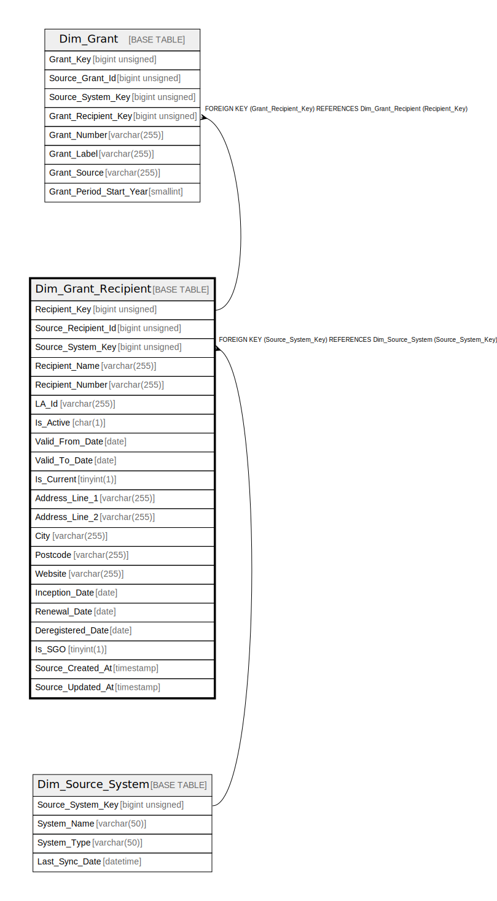

# Dim_Grant_Recipient

## Description

<details>
<summary><strong>Table Definition</strong></summary>

```sql
CREATE TABLE `Dim_Grant_Recipient` (
  `Recipient_Key` bigint unsigned NOT NULL AUTO_INCREMENT,
  `Source_Recipient_Id` bigint unsigned NOT NULL,
  `Source_System_Key` bigint unsigned NOT NULL,
  `Recipient_Name` varchar(255) CHARACTER SET utf8mb4 COLLATE utf8mb4_unicode_ci NOT NULL,
  `Recipient_Number` varchar(255) CHARACTER SET utf8mb4 COLLATE utf8mb4_unicode_ci DEFAULT NULL,
  `LA_Id` varchar(255) CHARACTER SET utf8mb4 COLLATE utf8mb4_unicode_ci DEFAULT NULL,
  `Is_Active` char(1) CHARACTER SET utf8mb4 COLLATE utf8mb4_unicode_ci NOT NULL,
  `Valid_From_Date` date NOT NULL,
  `Valid_To_Date` date NOT NULL DEFAULT '9999-12-31',
  `Is_Current` tinyint(1) NOT NULL DEFAULT '1',
  `Address_Line_1` varchar(255) CHARACTER SET utf8mb4 COLLATE utf8mb4_unicode_ci DEFAULT NULL,
  `Address_Line_2` varchar(255) CHARACTER SET utf8mb4 COLLATE utf8mb4_unicode_ci DEFAULT NULL,
  `City` varchar(255) CHARACTER SET utf8mb4 COLLATE utf8mb4_unicode_ci DEFAULT NULL,
  `Postcode` varchar(255) CHARACTER SET utf8mb4 COLLATE utf8mb4_unicode_ci DEFAULT NULL,
  `Website` varchar(255) CHARACTER SET utf8mb4 COLLATE utf8mb4_unicode_ci DEFAULT NULL,
  `Inception_Date` date DEFAULT NULL,
  `Renewal_Date` date DEFAULT NULL,
  `Deregistered_Date` date DEFAULT NULL,
  `Is_SGO` tinyint(1) NOT NULL DEFAULT '0',
  `Source_Created_At` timestamp NULL DEFAULT NULL,
  `Source_Updated_At` timestamp NULL DEFAULT NULL,
  PRIMARY KEY (`Recipient_Key`),
  KEY `dim_grant_recipient_source_system_key_foreign` (`Source_System_Key`),
  KEY `idx_gr_source` (`Source_Recipient_Id`,`Is_Current`),
  CONSTRAINT `dim_grant_recipient_source_system_key_foreign` FOREIGN KEY (`Source_System_Key`) REFERENCES `Dim_Source_System` (`Source_System_Key`)
) ENGINE=InnoDB AUTO_INCREMENT=[Redacted by tbls] DEFAULT CHARSET=utf8mb4 COLLATE=utf8mb4_unicode_ci
```

</details>

## Columns

| Name | Type | Default | Nullable | Extra Definition | Children | Parents | Comment |
| ---- | ---- | ------- | -------- | ---------------- | -------- | ------- | ------- |
| Recipient_Key | bigint unsigned |  | false | auto_increment | [Dim_Grant](Dim_Grant.md) |  |  |
| Source_Recipient_Id | bigint unsigned |  | false |  |  |  |  |
| Source_System_Key | bigint unsigned |  | false |  |  | [Dim_Source_System](Dim_Source_System.md) |  |
| Recipient_Name | varchar(255) |  | false |  |  |  |  |
| Recipient_Number | varchar(255) |  | true |  |  |  |  |
| LA_Id | varchar(255) |  | true |  |  |  |  |
| Is_Active | char(1) |  | false |  |  |  |  |
| Valid_From_Date | date |  | false |  |  |  |  |
| Valid_To_Date | date | 9999-12-31 | false |  |  |  |  |
| Is_Current | tinyint(1) | 1 | false |  |  |  |  |
| Address_Line_1 | varchar(255) |  | true |  |  |  |  |
| Address_Line_2 | varchar(255) |  | true |  |  |  |  |
| City | varchar(255) |  | true |  |  |  |  |
| Postcode | varchar(255) |  | true |  |  |  |  |
| Website | varchar(255) |  | true |  |  |  |  |
| Inception_Date | date |  | true |  |  |  |  |
| Renewal_Date | date |  | true |  |  |  |  |
| Deregistered_Date | date |  | true |  |  |  |  |
| Is_SGO | tinyint(1) | 0 | false |  |  |  |  |
| Source_Created_At | timestamp |  | true |  |  |  |  |
| Source_Updated_At | timestamp |  | true |  |  |  |  |

## Constraints

| Name | Type | Definition |
| ---- | ---- | ---------- |
| dim_grant_recipient_source_system_key_foreign | FOREIGN KEY | FOREIGN KEY (Source_System_Key) REFERENCES Dim_Source_System (Source_System_Key) |
| PRIMARY | PRIMARY KEY | PRIMARY KEY (Recipient_Key) |

## Indexes

| Name | Definition |
| ---- | ---------- |
| dim_grant_recipient_source_system_key_foreign | KEY dim_grant_recipient_source_system_key_foreign (Source_System_Key) USING BTREE |
| idx_gr_source | KEY idx_gr_source (Source_Recipient_Id, Is_Current) USING BTREE |
| PRIMARY | PRIMARY KEY (Recipient_Key) USING BTREE |

## Relations



---

> Generated by [tbls](https://github.com/k1LoW/tbls)
