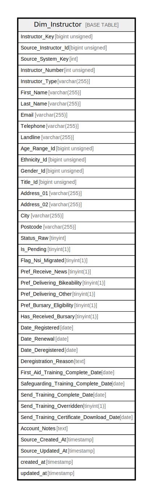

# Dim_Instructor

## Description

<details>
<summary><strong>Table Definition</strong></summary>

```sql
CREATE TABLE `Dim_Instructor` (
  `Instructor_Key` bigint unsigned NOT NULL AUTO_INCREMENT,
  `Source_Instructor_Id` bigint unsigned NOT NULL,
  `Source_System_Key` int NOT NULL,
  `Instructor_Number` int unsigned NOT NULL,
  `Instructor_Type` varchar(255) CHARACTER SET utf8mb4 COLLATE utf8mb4_unicode_ci DEFAULT NULL,
  `First_Name` varchar(255) CHARACTER SET utf8mb4 COLLATE utf8mb4_unicode_ci NOT NULL,
  `Last_Name` varchar(255) CHARACTER SET utf8mb4 COLLATE utf8mb4_unicode_ci NOT NULL,
  `Email` varchar(255) CHARACTER SET utf8mb4 COLLATE utf8mb4_unicode_ci NOT NULL,
  `Telephone` varchar(255) CHARACTER SET utf8mb4 COLLATE utf8mb4_unicode_ci DEFAULT NULL,
  `Landline` varchar(255) CHARACTER SET utf8mb4 COLLATE utf8mb4_unicode_ci DEFAULT NULL,
  `Age_Range_Id` bigint unsigned NOT NULL DEFAULT '1',
  `Ethnicity_Id` bigint unsigned NOT NULL DEFAULT '1',
  `Gender_Id` bigint unsigned NOT NULL DEFAULT '1',
  `Title_Id` bigint unsigned NOT NULL DEFAULT '1',
  `Address_01` varchar(255) CHARACTER SET utf8mb4 COLLATE utf8mb4_unicode_ci DEFAULT NULL,
  `Address_02` varchar(255) CHARACTER SET utf8mb4 COLLATE utf8mb4_unicode_ci DEFAULT NULL,
  `City` varchar(255) CHARACTER SET utf8mb4 COLLATE utf8mb4_unicode_ci DEFAULT NULL,
  `Postcode` varchar(255) CHARACTER SET utf8mb4 COLLATE utf8mb4_unicode_ci DEFAULT NULL,
  `Status_Raw` tinyint NOT NULL DEFAULT '0',
  `Is_Pending` tinyint(1) NOT NULL DEFAULT '0',
  `Flag_Nsi_Migrated` tinyint(1) NOT NULL DEFAULT '0',
  `Pref_Receive_News` tinyint(1) NOT NULL DEFAULT '0',
  `Pref_Delivering_Bikeability` tinyint(1) NOT NULL DEFAULT '0',
  `Pref_Delivering_Other` tinyint(1) NOT NULL DEFAULT '0',
  `Pref_Bursary_Eligibility` tinyint(1) NOT NULL DEFAULT '0',
  `Has_Received_Bursary` tinyint(1) NOT NULL DEFAULT '0',
  `Date_Registered` date DEFAULT NULL,
  `Date_Renewal` date DEFAULT NULL,
  `Date_Deregistered` date DEFAULT NULL,
  `Deregistration_Reason` text CHARACTER SET utf8mb4 COLLATE utf8mb4_unicode_ci,
  `First_Aid_Training_Complete_Date` date DEFAULT NULL,
  `Safeguarding_Training_Complete_Date` date DEFAULT NULL,
  `Send_Training_Complete_Date` date DEFAULT NULL,
  `Send_Training_Overridden` tinyint(1) NOT NULL DEFAULT '0',
  `Send_Training_Certificate_Download_Date` date DEFAULT NULL,
  `Account_Notes` text CHARACTER SET utf8mb4 COLLATE utf8mb4_unicode_ci,
  `Source_Created_At` timestamp NULL DEFAULT NULL,
  `Source_Updated_At` timestamp NULL DEFAULT NULL,
  `created_at` timestamp NULL DEFAULT NULL,
  `updated_at` timestamp NULL DEFAULT NULL,
  PRIMARY KEY (`Instructor_Key`),
  KEY `dim_instructor_source_instructor_id_source_system_key_index` (`Source_Instructor_Id`,`Source_System_Key`),
  KEY `dim_instructor_instructor_number_index` (`Instructor_Number`),
  KEY `dim_instructor_last_name_index` (`Last_Name`)
) ENGINE=InnoDB AUTO_INCREMENT=[Redacted by tbls] DEFAULT CHARSET=utf8mb4 COLLATE=utf8mb4_unicode_ci
```

</details>

## Columns

| Name | Type | Default | Nullable | Extra Definition | Children | Parents | Comment |
| ---- | ---- | ------- | -------- | ---------------- | -------- | ------- | ------- |
| Instructor_Key | bigint unsigned |  | false | auto_increment |  |  |  |
| Source_Instructor_Id | bigint unsigned |  | false |  |  |  |  |
| Source_System_Key | int |  | false |  |  |  |  |
| Instructor_Number | int unsigned |  | false |  |  |  |  |
| Instructor_Type | varchar(255) |  | true |  |  |  |  |
| First_Name | varchar(255) |  | false |  |  |  |  |
| Last_Name | varchar(255) |  | false |  |  |  |  |
| Email | varchar(255) |  | false |  |  |  |  |
| Telephone | varchar(255) |  | true |  |  |  |  |
| Landline | varchar(255) |  | true |  |  |  |  |
| Age_Range_Id | bigint unsigned | 1 | false |  |  |  |  |
| Ethnicity_Id | bigint unsigned | 1 | false |  |  |  |  |
| Gender_Id | bigint unsigned | 1 | false |  |  |  |  |
| Title_Id | bigint unsigned | 1 | false |  |  |  |  |
| Address_01 | varchar(255) |  | true |  |  |  |  |
| Address_02 | varchar(255) |  | true |  |  |  |  |
| City | varchar(255) |  | true |  |  |  |  |
| Postcode | varchar(255) |  | true |  |  |  |  |
| Status_Raw | tinyint | 0 | false |  |  |  |  |
| Is_Pending | tinyint(1) | 0 | false |  |  |  |  |
| Flag_Nsi_Migrated | tinyint(1) | 0 | false |  |  |  |  |
| Pref_Receive_News | tinyint(1) | 0 | false |  |  |  |  |
| Pref_Delivering_Bikeability | tinyint(1) | 0 | false |  |  |  |  |
| Pref_Delivering_Other | tinyint(1) | 0 | false |  |  |  |  |
| Pref_Bursary_Eligibility | tinyint(1) | 0 | false |  |  |  |  |
| Has_Received_Bursary | tinyint(1) | 0 | false |  |  |  |  |
| Date_Registered | date |  | true |  |  |  |  |
| Date_Renewal | date |  | true |  |  |  |  |
| Date_Deregistered | date |  | true |  |  |  |  |
| Deregistration_Reason | text |  | true |  |  |  |  |
| First_Aid_Training_Complete_Date | date |  | true |  |  |  |  |
| Safeguarding_Training_Complete_Date | date |  | true |  |  |  |  |
| Send_Training_Complete_Date | date |  | true |  |  |  |  |
| Send_Training_Overridden | tinyint(1) | 0 | false |  |  |  |  |
| Send_Training_Certificate_Download_Date | date |  | true |  |  |  |  |
| Account_Notes | text |  | true |  |  |  |  |
| Source_Created_At | timestamp |  | true |  |  |  |  |
| Source_Updated_At | timestamp |  | true |  |  |  |  |
| created_at | timestamp |  | true |  |  |  |  |
| updated_at | timestamp |  | true |  |  |  |  |

## Constraints

| Name | Type | Definition |
| ---- | ---- | ---------- |
| PRIMARY | PRIMARY KEY | PRIMARY KEY (Instructor_Key) |

## Indexes

| Name | Definition |
| ---- | ---------- |
| dim_instructor_instructor_number_index | KEY dim_instructor_instructor_number_index (Instructor_Number) USING BTREE |
| dim_instructor_last_name_index | KEY dim_instructor_last_name_index (Last_Name) USING BTREE |
| dim_instructor_source_instructor_id_source_system_key_index | KEY dim_instructor_source_instructor_id_source_system_key_index (Source_Instructor_Id, Source_System_Key) USING BTREE |
| PRIMARY | PRIMARY KEY (Instructor_Key) USING BTREE |

## Relations



---

> Generated by [tbls](https://github.com/k1LoW/tbls)
