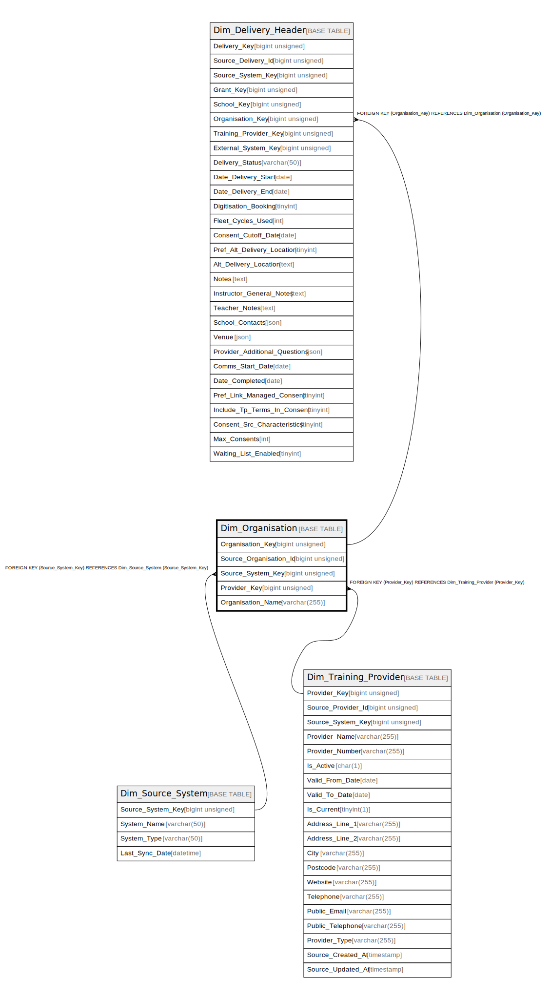

# Dim_Organisation

## Description

<details>
<summary><strong>Table Definition</strong></summary>

```sql
CREATE TABLE `Dim_Organisation` (
  `Organisation_Key` bigint unsigned NOT NULL AUTO_INCREMENT,
  `Source_Organisation_Id` bigint unsigned NOT NULL,
  `Source_System_Key` bigint unsigned NOT NULL,
  `Provider_Key` bigint unsigned NOT NULL,
  `Organisation_Name` varchar(255) CHARACTER SET utf8mb4 COLLATE utf8mb4_unicode_ci NOT NULL,
  PRIMARY KEY (`Organisation_Key`),
  KEY `dim_organisation_source_system_key_foreign` (`Source_System_Key`),
  KEY `dim_organisation_provider_key_foreign` (`Provider_Key`),
  KEY `idx_org_source` (`Source_Organisation_Id`,`Source_System_Key`),
  CONSTRAINT `dim_organisation_provider_key_foreign` FOREIGN KEY (`Provider_Key`) REFERENCES `Dim_Training_Provider` (`Provider_Key`),
  CONSTRAINT `dim_organisation_source_system_key_foreign` FOREIGN KEY (`Source_System_Key`) REFERENCES `Dim_Source_System` (`Source_System_Key`)
) ENGINE=InnoDB AUTO_INCREMENT=[Redacted by tbls] DEFAULT CHARSET=utf8mb4 COLLATE=utf8mb4_unicode_ci
```

</details>

## Columns

| Name | Type | Default | Nullable | Extra Definition | Children | Parents | Comment |
| ---- | ---- | ------- | -------- | ---------------- | -------- | ------- | ------- |
| Organisation_Key | bigint unsigned |  | false | auto_increment | [Dim_Delivery_Header](Dim_Delivery_Header.md) |  |  |
| Source_Organisation_Id | bigint unsigned |  | false |  |  |  |  |
| Source_System_Key | bigint unsigned |  | false |  |  | [Dim_Source_System](Dim_Source_System.md) |  |
| Provider_Key | bigint unsigned |  | false |  |  | [Dim_Training_Provider](Dim_Training_Provider.md) |  |
| Organisation_Name | varchar(255) |  | false |  |  |  |  |

## Constraints

| Name | Type | Definition |
| ---- | ---- | ---------- |
| dim_organisation_provider_key_foreign | FOREIGN KEY | FOREIGN KEY (Provider_Key) REFERENCES Dim_Training_Provider (Provider_Key) |
| dim_organisation_source_system_key_foreign | FOREIGN KEY | FOREIGN KEY (Source_System_Key) REFERENCES Dim_Source_System (Source_System_Key) |
| PRIMARY | PRIMARY KEY | PRIMARY KEY (Organisation_Key) |

## Indexes

| Name | Definition |
| ---- | ---------- |
| dim_organisation_provider_key_foreign | KEY dim_organisation_provider_key_foreign (Provider_Key) USING BTREE |
| dim_organisation_source_system_key_foreign | KEY dim_organisation_source_system_key_foreign (Source_System_Key) USING BTREE |
| idx_org_source | KEY idx_org_source (Source_Organisation_Id, Source_System_Key) USING BTREE |
| PRIMARY | PRIMARY KEY (Organisation_Key) USING BTREE |

## Relations



---

> Generated by [tbls](https://github.com/k1LoW/tbls)
