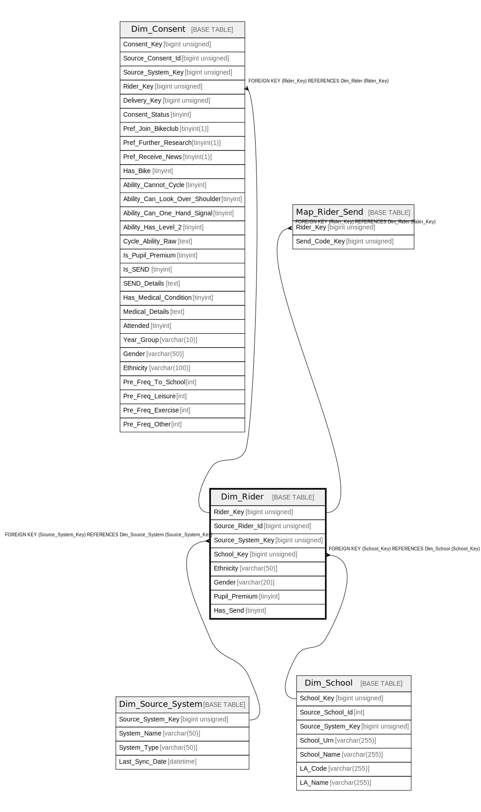

# Dim_Rider

## Description

<details>
<summary><strong>Table Definition</strong></summary>

```sql
CREATE TABLE `Dim_Rider` (
  `Rider_Key` bigint unsigned NOT NULL AUTO_INCREMENT,
  `Source_Rider_Id` bigint unsigned NOT NULL,
  `Source_System_Key` bigint unsigned NOT NULL,
  `School_Key` bigint unsigned DEFAULT NULL,
  `Ethnicity` varchar(50) CHARACTER SET utf8mb4 COLLATE utf8mb4_unicode_ci DEFAULT NULL,
  `Gender` varchar(20) CHARACTER SET utf8mb4 COLLATE utf8mb4_unicode_ci DEFAULT NULL,
  `Pupil_Premium` tinyint NOT NULL DEFAULT '0',
  `Has_Send` tinyint NOT NULL DEFAULT '0',
  PRIMARY KEY (`Rider_Key`),
  KEY `dim_rider_source_system_key_foreign` (`Source_System_Key`),
  KEY `dim_rider_school_key_foreign` (`School_Key`),
  KEY `dim_rider_source_rider_id_index` (`Source_Rider_Id`),
  CONSTRAINT `dim_rider_school_key_foreign` FOREIGN KEY (`School_Key`) REFERENCES `Dim_School` (`School_Key`),
  CONSTRAINT `dim_rider_source_system_key_foreign` FOREIGN KEY (`Source_System_Key`) REFERENCES `Dim_Source_System` (`Source_System_Key`)
) ENGINE=InnoDB AUTO_INCREMENT=[Redacted by tbls] DEFAULT CHARSET=utf8mb4 COLLATE=utf8mb4_unicode_ci
```

</details>

## Columns

| Name | Type | Default | Nullable | Extra Definition | Children | Parents | Comment |
| ---- | ---- | ------- | -------- | ---------------- | -------- | ------- | ------- |
| Rider_Key | bigint unsigned |  | false | auto_increment | [Dim_Consent](Dim_Consent.md) [Map_Rider_Send](Map_Rider_Send.md) |  |  |
| Source_Rider_Id | bigint unsigned |  | false |  |  |  |  |
| Source_System_Key | bigint unsigned |  | false |  |  | [Dim_Source_System](Dim_Source_System.md) |  |
| School_Key | bigint unsigned |  | true |  |  | [Dim_School](Dim_School.md) |  |
| Ethnicity | varchar(50) |  | true |  |  |  |  |
| Gender | varchar(20) |  | true |  |  |  |  |
| Pupil_Premium | tinyint | 0 | false |  |  |  |  |
| Has_Send | tinyint | 0 | false |  |  |  |  |

## Constraints

| Name | Type | Definition |
| ---- | ---- | ---------- |
| dim_rider_school_key_foreign | FOREIGN KEY | FOREIGN KEY (School_Key) REFERENCES Dim_School (School_Key) |
| dim_rider_source_system_key_foreign | FOREIGN KEY | FOREIGN KEY (Source_System_Key) REFERENCES Dim_Source_System (Source_System_Key) |
| PRIMARY | PRIMARY KEY | PRIMARY KEY (Rider_Key) |

## Indexes

| Name | Definition |
| ---- | ---------- |
| dim_rider_school_key_foreign | KEY dim_rider_school_key_foreign (School_Key) USING BTREE |
| dim_rider_source_rider_id_index | KEY dim_rider_source_rider_id_index (Source_Rider_Id) USING BTREE |
| dim_rider_source_system_key_foreign | KEY dim_rider_source_system_key_foreign (Source_System_Key) USING BTREE |
| PRIMARY | PRIMARY KEY (Rider_Key) USING BTREE |

## Relations



---

> Generated by [tbls](https://github.com/k1LoW/tbls)
