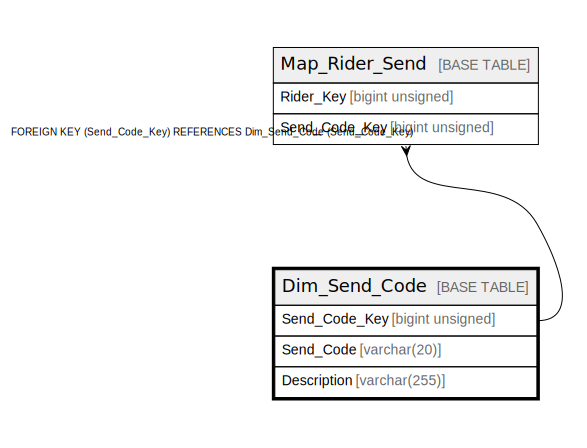

# Dim_Send_Code

## Description

<details>
<summary><strong>Table Definition</strong></summary>

```sql
CREATE TABLE `Dim_Send_Code` (
  `Send_Code_Key` bigint unsigned NOT NULL AUTO_INCREMENT,
  `Send_Code` varchar(20) CHARACTER SET utf8mb4 COLLATE utf8mb4_unicode_ci NOT NULL,
  `Description` varchar(255) CHARACTER SET utf8mb4 COLLATE utf8mb4_unicode_ci DEFAULT NULL,
  PRIMARY KEY (`Send_Code_Key`),
  UNIQUE KEY `dim_send_code_send_code_unique` (`Send_Code`)
) ENGINE=InnoDB AUTO_INCREMENT=[Redacted by tbls] DEFAULT CHARSET=utf8mb4 COLLATE=utf8mb4_unicode_ci
```

</details>

## Columns

| Name | Type | Default | Nullable | Extra Definition | Children | Parents | Comment |
| ---- | ---- | ------- | -------- | ---------------- | -------- | ------- | ------- |
| Send_Code_Key | bigint unsigned |  | false | auto_increment | [Map_Rider_Send](Map_Rider_Send.md) |  |  |
| Send_Code | varchar(20) |  | false |  |  |  |  |
| Description | varchar(255) |  | true |  |  |  |  |

## Constraints

| Name | Type | Definition |
| ---- | ---- | ---------- |
| dim_send_code_send_code_unique | UNIQUE | UNIQUE KEY dim_send_code_send_code_unique (Send_Code) |
| PRIMARY | PRIMARY KEY | PRIMARY KEY (Send_Code_Key) |

## Indexes

| Name | Definition |
| ---- | ---------- |
| PRIMARY | PRIMARY KEY (Send_Code_Key) USING BTREE |
| dim_send_code_send_code_unique | UNIQUE KEY dim_send_code_send_code_unique (Send_Code) USING BTREE |

## Relations



---

> Generated by [tbls](https://github.com/k1LoW/tbls)
