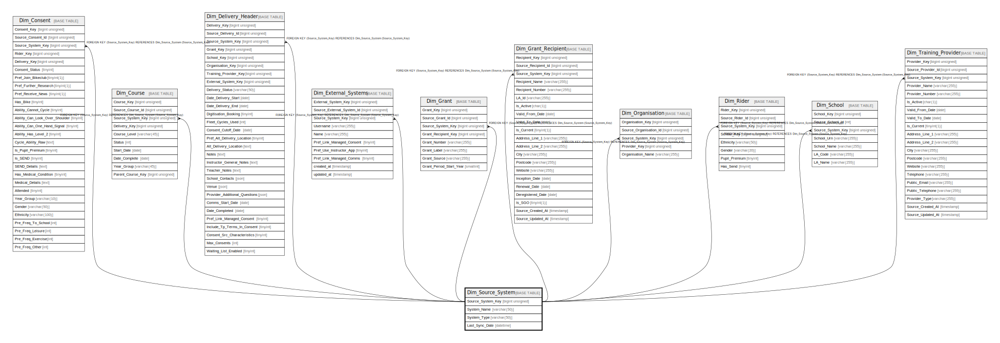

# Dim_Source_System

## Description

<details>
<summary><strong>Table Definition</strong></summary>

```sql
CREATE TABLE `Dim_Source_System` (
  `Source_System_Key` bigint unsigned NOT NULL AUTO_INCREMENT,
  `System_Name` varchar(50) CHARACTER SET utf8mb4 COLLATE utf8mb4_unicode_ci NOT NULL,
  `System_Type` varchar(50) CHARACTER SET utf8mb4 COLLATE utf8mb4_unicode_ci NOT NULL,
  `Last_Sync_Date` datetime DEFAULT NULL,
  PRIMARY KEY (`Source_System_Key`)
) ENGINE=InnoDB AUTO_INCREMENT=[Redacted by tbls] DEFAULT CHARSET=utf8mb4 COLLATE=utf8mb4_unicode_ci
```

</details>

## Columns

| Name | Type | Default | Nullable | Extra Definition | Children | Parents | Comment |
| ---- | ---- | ------- | -------- | ---------------- | -------- | ------- | ------- |
| Source_System_Key | bigint unsigned |  | false | auto_increment | [Dim_Consent](Dim_Consent.md) [Dim_Course](Dim_Course.md) [Dim_Delivery_Header](Dim_Delivery_Header.md) [Dim_External_Systems](Dim_External_Systems.md) [Dim_Grant](Dim_Grant.md) [Dim_Grant_Recipient](Dim_Grant_Recipient.md) [Dim_Organisation](Dim_Organisation.md) [Dim_Rider](Dim_Rider.md) [Dim_School](Dim_School.md) [Dim_Training_Provider](Dim_Training_Provider.md) |  |  |
| System_Name | varchar(50) |  | false |  |  |  |  |
| System_Type | varchar(50) |  | false |  |  |  |  |
| Last_Sync_Date | datetime |  | true |  |  |  |  |

## Constraints

| Name | Type | Definition |
| ---- | ---- | ---------- |
| PRIMARY | PRIMARY KEY | PRIMARY KEY (Source_System_Key) |

## Indexes

| Name | Definition |
| ---- | ---------- |
| PRIMARY | PRIMARY KEY (Source_System_Key) USING BTREE |

## Relations



---

> Generated by [tbls](https://github.com/k1LoW/tbls)
