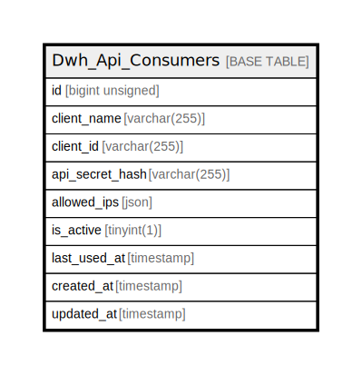

# Dwh_Api_Consumers

## Description

<details>
<summary><strong>Table Definition</strong></summary>

```sql
CREATE TABLE `Dwh_Api_Consumers` (
  `id` bigint unsigned NOT NULL AUTO_INCREMENT,
  `client_name` varchar(255) CHARACTER SET utf8mb4 COLLATE utf8mb4_unicode_ci NOT NULL COMMENT 'e.g., Primary Source System, PowerBI Gateway',
  `client_id` varchar(255) CHARACTER SET utf8mb4 COLLATE utf8mb4_unicode_ci NOT NULL,
  `api_secret_hash` varchar(255) CHARACTER SET utf8mb4 COLLATE utf8mb4_unicode_ci NOT NULL COMMENT 'Bcrypt/SHA256 hashed secret token string',
  `allowed_ips` json DEFAULT NULL COMMENT 'Array of explicit server IPs allowed to call with this key',
  `is_active` tinyint(1) NOT NULL DEFAULT '1',
  `last_used_at` timestamp NULL DEFAULT NULL,
  `created_at` timestamp NULL DEFAULT NULL,
  `updated_at` timestamp NULL DEFAULT NULL,
  PRIMARY KEY (`id`),
  UNIQUE KEY `dwh_api_consumers_client_name_unique` (`client_name`),
  UNIQUE KEY `dwh_api_consumers_client_id_unique` (`client_id`)
) ENGINE=InnoDB AUTO_INCREMENT=[Redacted by tbls] DEFAULT CHARSET=utf8mb4 COLLATE=utf8mb4_unicode_ci
```

</details>

## Columns

| Name | Type | Default | Nullable | Extra Definition | Children | Parents | Comment |
| ---- | ---- | ------- | -------- | ---------------- | -------- | ------- | ------- |
| id | bigint unsigned |  | false | auto_increment |  |  |  |
| client_name | varchar(255) |  | false |  |  |  | e.g., Primary Source System, PowerBI Gateway |
| client_id | varchar(255) |  | false |  |  |  |  |
| api_secret_hash | varchar(255) |  | false |  |  |  | Bcrypt/SHA256 hashed secret token string |
| allowed_ips | json |  | true |  |  |  | Array of explicit server IPs allowed to call with this key |
| is_active | tinyint(1) | 1 | false |  |  |  |  |
| last_used_at | timestamp |  | true |  |  |  |  |
| created_at | timestamp |  | true |  |  |  |  |
| updated_at | timestamp |  | true |  |  |  |  |

## Constraints

| Name | Type | Definition |
| ---- | ---- | ---------- |
| dwh_api_consumers_client_id_unique | UNIQUE | UNIQUE KEY dwh_api_consumers_client_id_unique (client_id) |
| dwh_api_consumers_client_name_unique | UNIQUE | UNIQUE KEY dwh_api_consumers_client_name_unique (client_name) |
| PRIMARY | PRIMARY KEY | PRIMARY KEY (id) |

## Indexes

| Name | Definition |
| ---- | ---------- |
| PRIMARY | PRIMARY KEY (id) USING BTREE |
| dwh_api_consumers_client_id_unique | UNIQUE KEY dwh_api_consumers_client_id_unique (client_id) USING BTREE |
| dwh_api_consumers_client_name_unique | UNIQUE KEY dwh_api_consumers_client_name_unique (client_name) USING BTREE |

## Relations



---

> Generated by [tbls](https://github.com/k1LoW/tbls)
