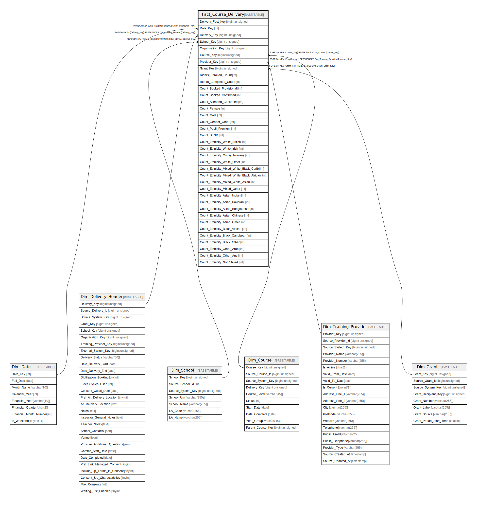

# Fact_Course_Delivery

## Description

<details>
<summary><strong>Table Definition</strong></summary>

```sql
CREATE TABLE `Fact_Course_Delivery` (
  `Delivery_Fact_Key` bigint unsigned NOT NULL AUTO_INCREMENT,
  `Date_Key` int DEFAULT NULL,
  `Delivery_Key` bigint unsigned NOT NULL,
  `School_Key` bigint unsigned DEFAULT NULL,
  `Organisation_Key` bigint unsigned DEFAULT NULL,
  `Course_Key` bigint unsigned NOT NULL,
  `Provider_Key` bigint unsigned NOT NULL,
  `Grant_Key` bigint unsigned DEFAULT NULL,
  `Riders_Enrolled_Count` int NOT NULL DEFAULT '0',
  `Riders_Completed_Count` int NOT NULL DEFAULT '0',
  `Count_Booked_Provisional` int NOT NULL DEFAULT '0',
  `Count_Booked_Confirmed` int NOT NULL DEFAULT '0',
  `Count_Attended_Confirmed` int NOT NULL DEFAULT '0',
  `Count_Female` int NOT NULL DEFAULT '0',
  `Count_Male` int NOT NULL DEFAULT '0',
  `Count_Gender_Other` int NOT NULL DEFAULT '0',
  `Count_Pupil_Premium` int NOT NULL DEFAULT '0',
  `Count_SEND` int NOT NULL DEFAULT '0',
  `Count_Ethnicity_White_British` int NOT NULL DEFAULT '0',
  `Count_Ethnicity_White_Irish` int NOT NULL DEFAULT '0',
  `Count_Ethnicity_Gypsy_Romany` int NOT NULL DEFAULT '0',
  `Count_Ethnicity_White_Other` int NOT NULL DEFAULT '0',
  `Count_Ethnicity_Mixed_White_Black_Carib` int NOT NULL DEFAULT '0',
  `Count_Ethnicity_Mixed_White_Black_African` int NOT NULL DEFAULT '0',
  `Count_Ethnicity_Mixed_White_Asian` int NOT NULL DEFAULT '0',
  `Count_Ethnicity_Mixed_Other` int NOT NULL DEFAULT '0',
  `Count_Ethnicity_Asian_Indian` int NOT NULL DEFAULT '0',
  `Count_Ethnicity_Asian_Pakistani` int NOT NULL DEFAULT '0',
  `Count_Ethnicity_Asian_Bangladeshi` int NOT NULL DEFAULT '0',
  `Count_Ethnicity_Asian_Chinese` int NOT NULL DEFAULT '0',
  `Count_Ethnicity_Asian_Other` int NOT NULL DEFAULT '0',
  `Count_Ethnicity_Black_African` int NOT NULL DEFAULT '0',
  `Count_Ethnicity_Black_Caribbean` int NOT NULL DEFAULT '0',
  `Count_Ethnicity_Black_Other` int NOT NULL DEFAULT '0',
  `Count_Ethnicity_Other_Arab` int NOT NULL DEFAULT '0',
  `Count_Ethnicity_Other_Any` int NOT NULL DEFAULT '0',
  `Count_Ethnicity_Not_Stated` int NOT NULL DEFAULT '0',
  PRIMARY KEY (`Delivery_Fact_Key`),
  KEY `fact_course_delivery_date_key_foreign` (`Date_Key`),
  KEY `fact_course_delivery_delivery_key_foreign` (`Delivery_Key`),
  KEY `fact_course_delivery_school_key_foreign` (`School_Key`),
  KEY `fact_course_delivery_course_key_foreign` (`Course_Key`),
  KEY `fact_course_delivery_provider_key_foreign` (`Provider_Key`),
  KEY `fact_course_delivery_grant_key_foreign` (`Grant_Key`),
  CONSTRAINT `fact_course_delivery_course_key_foreign` FOREIGN KEY (`Course_Key`) REFERENCES `Dim_Course` (`Course_Key`),
  CONSTRAINT `fact_course_delivery_date_key_foreign` FOREIGN KEY (`Date_Key`) REFERENCES `Dim_Date` (`Date_Key`),
  CONSTRAINT `fact_course_delivery_delivery_key_foreign` FOREIGN KEY (`Delivery_Key`) REFERENCES `Dim_Delivery_Header` (`Delivery_Key`),
  CONSTRAINT `fact_course_delivery_grant_key_foreign` FOREIGN KEY (`Grant_Key`) REFERENCES `Dim_Grant` (`Grant_Key`),
  CONSTRAINT `fact_course_delivery_provider_key_foreign` FOREIGN KEY (`Provider_Key`) REFERENCES `Dim_Training_Provider` (`Provider_Key`),
  CONSTRAINT `fact_course_delivery_school_key_foreign` FOREIGN KEY (`School_Key`) REFERENCES `Dim_School` (`School_Key`)
) ENGINE=InnoDB AUTO_INCREMENT=[Redacted by tbls] DEFAULT CHARSET=utf8mb4 COLLATE=utf8mb4_unicode_ci
```

</details>

## Columns

| Name | Type | Default | Nullable | Extra Definition | Children | Parents | Comment |
| ---- | ---- | ------- | -------- | ---------------- | -------- | ------- | ------- |
| Delivery_Fact_Key | bigint unsigned |  | false | auto_increment |  |  |  |
| Date_Key | int |  | true |  |  | [Dim_Date](Dim_Date.md) |  |
| Delivery_Key | bigint unsigned |  | false |  |  | [Dim_Delivery_Header](Dim_Delivery_Header.md) |  |
| School_Key | bigint unsigned |  | true |  |  | [Dim_School](Dim_School.md) |  |
| Organisation_Key | bigint unsigned |  | true |  |  |  |  |
| Course_Key | bigint unsigned |  | false |  |  | [Dim_Course](Dim_Course.md) |  |
| Provider_Key | bigint unsigned |  | false |  |  | [Dim_Training_Provider](Dim_Training_Provider.md) |  |
| Grant_Key | bigint unsigned |  | true |  |  | [Dim_Grant](Dim_Grant.md) |  |
| Riders_Enrolled_Count | int | 0 | false |  |  |  |  |
| Riders_Completed_Count | int | 0 | false |  |  |  |  |
| Count_Booked_Provisional | int | 0 | false |  |  |  |  |
| Count_Booked_Confirmed | int | 0 | false |  |  |  |  |
| Count_Attended_Confirmed | int | 0 | false |  |  |  |  |
| Count_Female | int | 0 | false |  |  |  |  |
| Count_Male | int | 0 | false |  |  |  |  |
| Count_Gender_Other | int | 0 | false |  |  |  |  |
| Count_Pupil_Premium | int | 0 | false |  |  |  |  |
| Count_SEND | int | 0 | false |  |  |  |  |
| Count_Ethnicity_White_British | int | 0 | false |  |  |  |  |
| Count_Ethnicity_White_Irish | int | 0 | false |  |  |  |  |
| Count_Ethnicity_Gypsy_Romany | int | 0 | false |  |  |  |  |
| Count_Ethnicity_White_Other | int | 0 | false |  |  |  |  |
| Count_Ethnicity_Mixed_White_Black_Carib | int | 0 | false |  |  |  |  |
| Count_Ethnicity_Mixed_White_Black_African | int | 0 | false |  |  |  |  |
| Count_Ethnicity_Mixed_White_Asian | int | 0 | false |  |  |  |  |
| Count_Ethnicity_Mixed_Other | int | 0 | false |  |  |  |  |
| Count_Ethnicity_Asian_Indian | int | 0 | false |  |  |  |  |
| Count_Ethnicity_Asian_Pakistani | int | 0 | false |  |  |  |  |
| Count_Ethnicity_Asian_Bangladeshi | int | 0 | false |  |  |  |  |
| Count_Ethnicity_Asian_Chinese | int | 0 | false |  |  |  |  |
| Count_Ethnicity_Asian_Other | int | 0 | false |  |  |  |  |
| Count_Ethnicity_Black_African | int | 0 | false |  |  |  |  |
| Count_Ethnicity_Black_Caribbean | int | 0 | false |  |  |  |  |
| Count_Ethnicity_Black_Other | int | 0 | false |  |  |  |  |
| Count_Ethnicity_Other_Arab | int | 0 | false |  |  |  |  |
| Count_Ethnicity_Other_Any | int | 0 | false |  |  |  |  |
| Count_Ethnicity_Not_Stated | int | 0 | false |  |  |  |  |

## Constraints

| Name | Type | Definition |
| ---- | ---- | ---------- |
| fact_course_delivery_course_key_foreign | FOREIGN KEY | FOREIGN KEY (Course_Key) REFERENCES Dim_Course (Course_Key) |
| fact_course_delivery_date_key_foreign | FOREIGN KEY | FOREIGN KEY (Date_Key) REFERENCES Dim_Date (Date_Key) |
| fact_course_delivery_delivery_key_foreign | FOREIGN KEY | FOREIGN KEY (Delivery_Key) REFERENCES Dim_Delivery_Header (Delivery_Key) |
| fact_course_delivery_grant_key_foreign | FOREIGN KEY | FOREIGN KEY (Grant_Key) REFERENCES Dim_Grant (Grant_Key) |
| fact_course_delivery_provider_key_foreign | FOREIGN KEY | FOREIGN KEY (Provider_Key) REFERENCES Dim_Training_Provider (Provider_Key) |
| fact_course_delivery_school_key_foreign | FOREIGN KEY | FOREIGN KEY (School_Key) REFERENCES Dim_School (School_Key) |
| PRIMARY | PRIMARY KEY | PRIMARY KEY (Delivery_Fact_Key) |

## Indexes

| Name | Definition |
| ---- | ---------- |
| fact_course_delivery_course_key_foreign | KEY fact_course_delivery_course_key_foreign (Course_Key) USING BTREE |
| fact_course_delivery_date_key_foreign | KEY fact_course_delivery_date_key_foreign (Date_Key) USING BTREE |
| fact_course_delivery_delivery_key_foreign | KEY fact_course_delivery_delivery_key_foreign (Delivery_Key) USING BTREE |
| fact_course_delivery_grant_key_foreign | KEY fact_course_delivery_grant_key_foreign (Grant_Key) USING BTREE |
| fact_course_delivery_provider_key_foreign | KEY fact_course_delivery_provider_key_foreign (Provider_Key) USING BTREE |
| fact_course_delivery_school_key_foreign | KEY fact_course_delivery_school_key_foreign (School_Key) USING BTREE |
| PRIMARY | PRIMARY KEY (Delivery_Fact_Key) USING BTREE |

## Relations



---

> Generated by [tbls](https://github.com/k1LoW/tbls)
