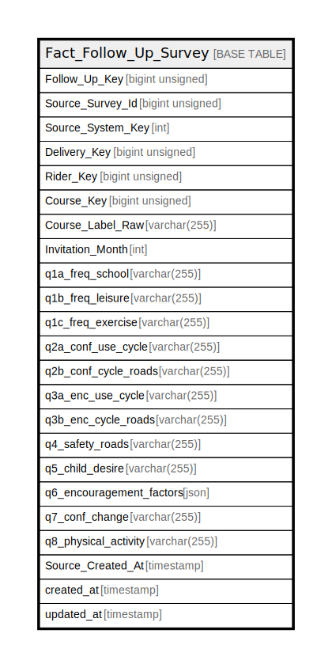

# Fact_Follow_Up_Survey

## Description

<details>
<summary><strong>Table Definition</strong></summary>

```sql
CREATE TABLE `Fact_Follow_Up_Survey` (
  `Follow_Up_Key` bigint unsigned NOT NULL AUTO_INCREMENT,
  `Source_Survey_Id` bigint unsigned NOT NULL,
  `Source_System_Key` int NOT NULL,
  `Delivery_Key` bigint unsigned NOT NULL,
  `Rider_Key` bigint unsigned NOT NULL,
  `Course_Key` bigint unsigned NOT NULL,
  `Course_Label_Raw` varchar(255) CHARACTER SET utf8mb4 COLLATE utf8mb4_unicode_ci NOT NULL,
  `Invitation_Month` int DEFAULT NULL,
  `q1a_freq_school` varchar(255) CHARACTER SET utf8mb4 COLLATE utf8mb4_unicode_ci DEFAULT NULL,
  `q1b_freq_leisure` varchar(255) CHARACTER SET utf8mb4 COLLATE utf8mb4_unicode_ci DEFAULT NULL,
  `q1c_freq_exercise` varchar(255) CHARACTER SET utf8mb4 COLLATE utf8mb4_unicode_ci DEFAULT NULL,
  `q2a_conf_use_cycle` varchar(255) CHARACTER SET utf8mb4 COLLATE utf8mb4_unicode_ci DEFAULT NULL,
  `q2b_conf_cycle_roads` varchar(255) CHARACTER SET utf8mb4 COLLATE utf8mb4_unicode_ci DEFAULT NULL,
  `q3a_enc_use_cycle` varchar(255) CHARACTER SET utf8mb4 COLLATE utf8mb4_unicode_ci DEFAULT NULL,
  `q3b_enc_cycle_roads` varchar(255) CHARACTER SET utf8mb4 COLLATE utf8mb4_unicode_ci DEFAULT NULL,
  `q4_safety_roads` varchar(255) CHARACTER SET utf8mb4 COLLATE utf8mb4_unicode_ci DEFAULT NULL,
  `q5_child_desire` varchar(255) CHARACTER SET utf8mb4 COLLATE utf8mb4_unicode_ci DEFAULT NULL,
  `q6_encouragement_factors` json DEFAULT NULL,
  `q7_conf_change` varchar(255) CHARACTER SET utf8mb4 COLLATE utf8mb4_unicode_ci DEFAULT NULL,
  `q8_physical_activity` varchar(255) CHARACTER SET utf8mb4 COLLATE utf8mb4_unicode_ci DEFAULT NULL,
  `Source_Created_At` timestamp NULL DEFAULT NULL,
  `created_at` timestamp NULL DEFAULT NULL,
  `updated_at` timestamp NULL DEFAULT NULL,
  PRIMARY KEY (`Follow_Up_Key`),
  KEY `fact_follow_up_survey_source_survey_id_source_system_key_index` (`Source_Survey_Id`,`Source_System_Key`)
) ENGINE=InnoDB AUTO_INCREMENT=[Redacted by tbls] DEFAULT CHARSET=utf8mb4 COLLATE=utf8mb4_unicode_ci
```

</details>

## Columns

| Name | Type | Default | Nullable | Extra Definition | Children | Parents | Comment |
| ---- | ---- | ------- | -------- | ---------------- | -------- | ------- | ------- |
| Follow_Up_Key | bigint unsigned |  | false | auto_increment |  |  |  |
| Source_Survey_Id | bigint unsigned |  | false |  |  |  |  |
| Source_System_Key | int |  | false |  |  |  |  |
| Delivery_Key | bigint unsigned |  | false |  |  |  |  |
| Rider_Key | bigint unsigned |  | false |  |  |  |  |
| Course_Key | bigint unsigned |  | false |  |  |  |  |
| Course_Label_Raw | varchar(255) |  | false |  |  |  |  |
| Invitation_Month | int |  | true |  |  |  |  |
| q1a_freq_school | varchar(255) |  | true |  |  |  |  |
| q1b_freq_leisure | varchar(255) |  | true |  |  |  |  |
| q1c_freq_exercise | varchar(255) |  | true |  |  |  |  |
| q2a_conf_use_cycle | varchar(255) |  | true |  |  |  |  |
| q2b_conf_cycle_roads | varchar(255) |  | true |  |  |  |  |
| q3a_enc_use_cycle | varchar(255) |  | true |  |  |  |  |
| q3b_enc_cycle_roads | varchar(255) |  | true |  |  |  |  |
| q4_safety_roads | varchar(255) |  | true |  |  |  |  |
| q5_child_desire | varchar(255) |  | true |  |  |  |  |
| q6_encouragement_factors | json |  | true |  |  |  |  |
| q7_conf_change | varchar(255) |  | true |  |  |  |  |
| q8_physical_activity | varchar(255) |  | true |  |  |  |  |
| Source_Created_At | timestamp |  | true |  |  |  |  |
| created_at | timestamp |  | true |  |  |  |  |
| updated_at | timestamp |  | true |  |  |  |  |

## Constraints

| Name | Type | Definition |
| ---- | ---- | ---------- |
| PRIMARY | PRIMARY KEY | PRIMARY KEY (Follow_Up_Key) |

## Indexes

| Name | Definition |
| ---- | ---------- |
| fact_follow_up_survey_source_survey_id_source_system_key_index | KEY fact_follow_up_survey_source_survey_id_source_system_key_index (Source_Survey_Id, Source_System_Key) USING BTREE |
| PRIMARY | PRIMARY KEY (Follow_Up_Key) USING BTREE |

## Relations



---

> Generated by [tbls](https://github.com/k1LoW/tbls)
