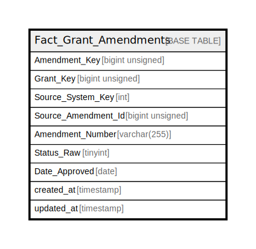

# Fact_Grant_Amendments

## Description

<details>
<summary><strong>Table Definition</strong></summary>

```sql
CREATE TABLE `Fact_Grant_Amendments` (
  `Amendment_Key` bigint unsigned NOT NULL AUTO_INCREMENT,
  `Grant_Key` bigint unsigned NOT NULL,
  `Source_System_Key` int NOT NULL,
  `Source_Amendment_Id` bigint unsigned NOT NULL,
  `Amendment_Number` varchar(255) CHARACTER SET utf8mb4 COLLATE utf8mb4_unicode_ci DEFAULT NULL,
  `Status_Raw` tinyint NOT NULL DEFAULT '0',
  `Date_Approved` date DEFAULT NULL,
  `created_at` timestamp NULL DEFAULT NULL,
  `updated_at` timestamp NULL DEFAULT NULL,
  PRIMARY KEY (`Amendment_Key`),
  KEY `idx_amend_base` (`Grant_Key`,`Source_Amendment_Id`)
) ENGINE=InnoDB AUTO_INCREMENT=[Redacted by tbls] DEFAULT CHARSET=utf8mb4 COLLATE=utf8mb4_unicode_ci
```

</details>

## Columns

| Name | Type | Default | Nullable | Extra Definition | Children | Parents | Comment |
| ---- | ---- | ------- | -------- | ---------------- | -------- | ------- | ------- |
| Amendment_Key | bigint unsigned |  | false | auto_increment |  |  |  |
| Grant_Key | bigint unsigned |  | false |  |  |  |  |
| Source_System_Key | int |  | false |  |  |  |  |
| Source_Amendment_Id | bigint unsigned |  | false |  |  |  |  |
| Amendment_Number | varchar(255) |  | true |  |  |  |  |
| Status_Raw | tinyint | 0 | false |  |  |  |  |
| Date_Approved | date |  | true |  |  |  |  |
| created_at | timestamp |  | true |  |  |  |  |
| updated_at | timestamp |  | true |  |  |  |  |

## Constraints

| Name | Type | Definition |
| ---- | ---- | ---------- |
| PRIMARY | PRIMARY KEY | PRIMARY KEY (Amendment_Key) |

## Indexes

| Name | Definition |
| ---- | ---------- |
| idx_amend_base | KEY idx_amend_base (Grant_Key, Source_Amendment_Id) USING BTREE |
| PRIMARY | PRIMARY KEY (Amendment_Key) USING BTREE |

## Relations



---

> Generated by [tbls](https://github.com/k1LoW/tbls)
