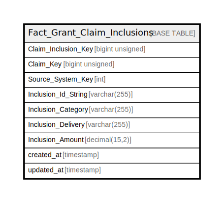

# Fact_Grant_Claim_Inclusions

## Description

<details>
<summary><strong>Table Definition</strong></summary>

```sql
CREATE TABLE `Fact_Grant_Claim_Inclusions` (
  `Claim_Inclusion_Key` bigint unsigned NOT NULL AUTO_INCREMENT,
  `Claim_Key` bigint unsigned NOT NULL,
  `Source_System_Key` int NOT NULL,
  `Inclusion_Id_String` varchar(255) CHARACTER SET utf8mb4 COLLATE utf8mb4_unicode_ci NOT NULL,
  `Inclusion_Category` varchar(255) CHARACTER SET utf8mb4 COLLATE utf8mb4_unicode_ci NOT NULL,
  `Inclusion_Delivery` varchar(255) CHARACTER SET utf8mb4 COLLATE utf8mb4_unicode_ci DEFAULT NULL,
  `Inclusion_Amount` decimal(15,2) NOT NULL DEFAULT '0.00',
  `created_at` timestamp NULL DEFAULT NULL,
  `updated_at` timestamp NULL DEFAULT NULL,
  PRIMARY KEY (`Claim_Inclusion_Key`),
  KEY `fact_grant_claim_inclusions_claim_key_index` (`Claim_Key`)
) ENGINE=InnoDB AUTO_INCREMENT=[Redacted by tbls] DEFAULT CHARSET=utf8mb4 COLLATE=utf8mb4_unicode_ci
```

</details>

## Columns

| Name | Type | Default | Nullable | Extra Definition | Children | Parents | Comment |
| ---- | ---- | ------- | -------- | ---------------- | -------- | ------- | ------- |
| Claim_Inclusion_Key | bigint unsigned |  | false | auto_increment |  |  |  |
| Claim_Key | bigint unsigned |  | false |  |  |  |  |
| Source_System_Key | int |  | false |  |  |  |  |
| Inclusion_Id_String | varchar(255) |  | false |  |  |  |  |
| Inclusion_Category | varchar(255) |  | false |  |  |  |  |
| Inclusion_Delivery | varchar(255) |  | true |  |  |  |  |
| Inclusion_Amount | decimal(15,2) | 0.00 | false |  |  |  |  |
| created_at | timestamp |  | true |  |  |  |  |
| updated_at | timestamp |  | true |  |  |  |  |

## Constraints

| Name | Type | Definition |
| ---- | ---- | ---------- |
| PRIMARY | PRIMARY KEY | PRIMARY KEY (Claim_Inclusion_Key) |

## Indexes

| Name | Definition |
| ---- | ---------- |
| fact_grant_claim_inclusions_claim_key_index | KEY fact_grant_claim_inclusions_claim_key_index (Claim_Key) USING BTREE |
| PRIMARY | PRIMARY KEY (Claim_Inclusion_Key) USING BTREE |

## Relations



---

> Generated by [tbls](https://github.com/k1LoW/tbls)
