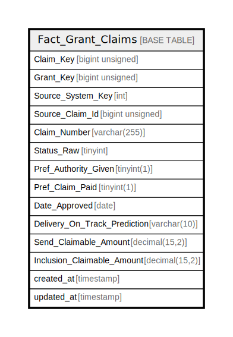

# Fact_Grant_Claims

## Description

<details>
<summary><strong>Table Definition</strong></summary>

```sql
CREATE TABLE `Fact_Grant_Claims` (
  `Claim_Key` bigint unsigned NOT NULL AUTO_INCREMENT,
  `Grant_Key` bigint unsigned NOT NULL,
  `Source_System_Key` int NOT NULL,
  `Source_Claim_Id` bigint unsigned NOT NULL,
  `Claim_Number` varchar(255) CHARACTER SET utf8mb4 COLLATE utf8mb4_unicode_ci DEFAULT NULL,
  `Status_Raw` tinyint NOT NULL DEFAULT '0',
  `Pref_Authority_Given` tinyint(1) NOT NULL DEFAULT '0',
  `Pref_Claim_Paid` tinyint(1) NOT NULL DEFAULT '0',
  `Date_Approved` date DEFAULT NULL,
  `Delivery_On_Track_Prediction` varchar(10) CHARACTER SET utf8mb4 COLLATE utf8mb4_unicode_ci DEFAULT NULL,
  `Send_Claimable_Amount` decimal(15,2) DEFAULT NULL,
  `Inclusion_Claimable_Amount` decimal(15,2) DEFAULT NULL,
  `created_at` timestamp NULL DEFAULT NULL,
  `updated_at` timestamp NULL DEFAULT NULL,
  PRIMARY KEY (`Claim_Key`),
  KEY `idx_claims_base` (`Grant_Key`,`Source_Claim_Id`)
) ENGINE=InnoDB AUTO_INCREMENT=[Redacted by tbls] DEFAULT CHARSET=utf8mb4 COLLATE=utf8mb4_unicode_ci
```

</details>

## Columns

| Name | Type | Default | Nullable | Extra Definition | Children | Parents | Comment |
| ---- | ---- | ------- | -------- | ---------------- | -------- | ------- | ------- |
| Claim_Key | bigint unsigned |  | false | auto_increment |  |  |  |
| Grant_Key | bigint unsigned |  | false |  |  |  |  |
| Source_System_Key | int |  | false |  |  |  |  |
| Source_Claim_Id | bigint unsigned |  | false |  |  |  |  |
| Claim_Number | varchar(255) |  | true |  |  |  |  |
| Status_Raw | tinyint | 0 | false |  |  |  |  |
| Pref_Authority_Given | tinyint(1) | 0 | false |  |  |  |  |
| Pref_Claim_Paid | tinyint(1) | 0 | false |  |  |  |  |
| Date_Approved | date |  | true |  |  |  |  |
| Delivery_On_Track_Prediction | varchar(10) |  | true |  |  |  |  |
| Send_Claimable_Amount | decimal(15,2) |  | true |  |  |  |  |
| Inclusion_Claimable_Amount | decimal(15,2) |  | true |  |  |  |  |
| created_at | timestamp |  | true |  |  |  |  |
| updated_at | timestamp |  | true |  |  |  |  |

## Constraints

| Name | Type | Definition |
| ---- | ---- | ---------- |
| PRIMARY | PRIMARY KEY | PRIMARY KEY (Claim_Key) |

## Indexes

| Name | Definition |
| ---- | ---------- |
| idx_claims_base | KEY idx_claims_base (Grant_Key, Source_Claim_Id) USING BTREE |
| PRIMARY | PRIMARY KEY (Claim_Key) USING BTREE |

## Relations



---

> Generated by [tbls](https://github.com/k1LoW/tbls)
