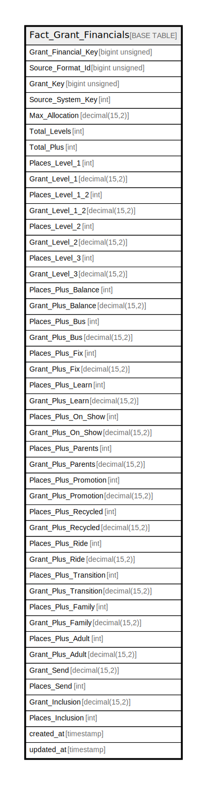

# Fact_Grant_Financials

## Description

<details>
<summary><strong>Table Definition</strong></summary>

```sql
CREATE TABLE `Fact_Grant_Financials` (
  `Grant_Financial_Key` bigint unsigned NOT NULL AUTO_INCREMENT,
  `Source_Format_Id` bigint unsigned NOT NULL,
  `Grant_Key` bigint unsigned NOT NULL,
  `Source_System_Key` int NOT NULL,
  `Max_Allocation` decimal(15,2) NOT NULL DEFAULT '0.00',
  `Total_Levels` int NOT NULL DEFAULT '0',
  `Total_Plus` int NOT NULL DEFAULT '0',
  `Places_Level_1` int NOT NULL DEFAULT '0',
  `Grant_Level_1` decimal(15,2) NOT NULL DEFAULT '0.00',
  `Places_Level_1_2` int NOT NULL DEFAULT '0',
  `Grant_Level_1_2` decimal(15,2) NOT NULL DEFAULT '0.00',
  `Places_Level_2` int NOT NULL DEFAULT '0',
  `Grant_Level_2` decimal(15,2) NOT NULL DEFAULT '0.00',
  `Places_Level_3` int NOT NULL DEFAULT '0',
  `Grant_Level_3` decimal(15,2) NOT NULL DEFAULT '0.00',
  `Places_Plus_Balance` int NOT NULL DEFAULT '0',
  `Grant_Plus_Balance` decimal(15,2) NOT NULL DEFAULT '0.00',
  `Places_Plus_Bus` int NOT NULL DEFAULT '0',
  `Grant_Plus_Bus` decimal(15,2) NOT NULL DEFAULT '0.00',
  `Places_Plus_Fix` int NOT NULL DEFAULT '0',
  `Grant_Plus_Fix` decimal(15,2) NOT NULL DEFAULT '0.00',
  `Places_Plus_Learn` int NOT NULL DEFAULT '0',
  `Grant_Plus_Learn` decimal(15,2) NOT NULL DEFAULT '0.00',
  `Places_Plus_On_Show` int NOT NULL DEFAULT '0',
  `Grant_Plus_On_Show` decimal(15,2) NOT NULL DEFAULT '0.00',
  `Places_Plus_Parents` int NOT NULL DEFAULT '0',
  `Grant_Plus_Parents` decimal(15,2) NOT NULL DEFAULT '0.00',
  `Places_Plus_Promotion` int NOT NULL DEFAULT '0',
  `Grant_Plus_Promotion` decimal(15,2) NOT NULL DEFAULT '0.00',
  `Places_Plus_Recycled` int NOT NULL DEFAULT '0',
  `Grant_Plus_Recycled` decimal(15,2) NOT NULL DEFAULT '0.00',
  `Places_Plus_Ride` int NOT NULL DEFAULT '0',
  `Grant_Plus_Ride` decimal(15,2) NOT NULL DEFAULT '0.00',
  `Places_Plus_Transition` int NOT NULL DEFAULT '0',
  `Grant_Plus_Transition` decimal(15,2) NOT NULL DEFAULT '0.00',
  `Places_Plus_Family` int NOT NULL DEFAULT '0',
  `Grant_Plus_Family` decimal(15,2) NOT NULL DEFAULT '0.00',
  `Places_Plus_Adult` int NOT NULL DEFAULT '0',
  `Grant_Plus_Adult` decimal(15,2) NOT NULL DEFAULT '0.00',
  `Grant_Send` decimal(15,2) NOT NULL DEFAULT '0.00',
  `Places_Send` int NOT NULL DEFAULT '0',
  `Grant_Inclusion` decimal(15,2) NOT NULL DEFAULT '0.00',
  `Places_Inclusion` int NOT NULL DEFAULT '0',
  `created_at` timestamp NULL DEFAULT NULL,
  `updated_at` timestamp NULL DEFAULT NULL,
  PRIMARY KEY (`Grant_Financial_Key`),
  KEY `fact_grant_financials_grant_key_source_system_key_index` (`Grant_Key`,`Source_System_Key`)
) ENGINE=InnoDB AUTO_INCREMENT=[Redacted by tbls] DEFAULT CHARSET=utf8mb4 COLLATE=utf8mb4_unicode_ci
```

</details>

## Columns

| Name | Type | Default | Nullable | Extra Definition | Children | Parents | Comment |
| ---- | ---- | ------- | -------- | ---------------- | -------- | ------- | ------- |
| Grant_Financial_Key | bigint unsigned |  | false | auto_increment |  |  |  |
| Source_Format_Id | bigint unsigned |  | false |  |  |  |  |
| Grant_Key | bigint unsigned |  | false |  |  |  |  |
| Source_System_Key | int |  | false |  |  |  |  |
| Max_Allocation | decimal(15,2) | 0.00 | false |  |  |  |  |
| Total_Levels | int | 0 | false |  |  |  |  |
| Total_Plus | int | 0 | false |  |  |  |  |
| Places_Level_1 | int | 0 | false |  |  |  |  |
| Grant_Level_1 | decimal(15,2) | 0.00 | false |  |  |  |  |
| Places_Level_1_2 | int | 0 | false |  |  |  |  |
| Grant_Level_1_2 | decimal(15,2) | 0.00 | false |  |  |  |  |
| Places_Level_2 | int | 0 | false |  |  |  |  |
| Grant_Level_2 | decimal(15,2) | 0.00 | false |  |  |  |  |
| Places_Level_3 | int | 0 | false |  |  |  |  |
| Grant_Level_3 | decimal(15,2) | 0.00 | false |  |  |  |  |
| Places_Plus_Balance | int | 0 | false |  |  |  |  |
| Grant_Plus_Balance | decimal(15,2) | 0.00 | false |  |  |  |  |
| Places_Plus_Bus | int | 0 | false |  |  |  |  |
| Grant_Plus_Bus | decimal(15,2) | 0.00 | false |  |  |  |  |
| Places_Plus_Fix | int | 0 | false |  |  |  |  |
| Grant_Plus_Fix | decimal(15,2) | 0.00 | false |  |  |  |  |
| Places_Plus_Learn | int | 0 | false |  |  |  |  |
| Grant_Plus_Learn | decimal(15,2) | 0.00 | false |  |  |  |  |
| Places_Plus_On_Show | int | 0 | false |  |  |  |  |
| Grant_Plus_On_Show | decimal(15,2) | 0.00 | false |  |  |  |  |
| Places_Plus_Parents | int | 0 | false |  |  |  |  |
| Grant_Plus_Parents | decimal(15,2) | 0.00 | false |  |  |  |  |
| Places_Plus_Promotion | int | 0 | false |  |  |  |  |
| Grant_Plus_Promotion | decimal(15,2) | 0.00 | false |  |  |  |  |
| Places_Plus_Recycled | int | 0 | false |  |  |  |  |
| Grant_Plus_Recycled | decimal(15,2) | 0.00 | false |  |  |  |  |
| Places_Plus_Ride | int | 0 | false |  |  |  |  |
| Grant_Plus_Ride | decimal(15,2) | 0.00 | false |  |  |  |  |
| Places_Plus_Transition | int | 0 | false |  |  |  |  |
| Grant_Plus_Transition | decimal(15,2) | 0.00 | false |  |  |  |  |
| Places_Plus_Family | int | 0 | false |  |  |  |  |
| Grant_Plus_Family | decimal(15,2) | 0.00 | false |  |  |  |  |
| Places_Plus_Adult | int | 0 | false |  |  |  |  |
| Grant_Plus_Adult | decimal(15,2) | 0.00 | false |  |  |  |  |
| Grant_Send | decimal(15,2) | 0.00 | false |  |  |  |  |
| Places_Send | int | 0 | false |  |  |  |  |
| Grant_Inclusion | decimal(15,2) | 0.00 | false |  |  |  |  |
| Places_Inclusion | int | 0 | false |  |  |  |  |
| created_at | timestamp |  | true |  |  |  |  |
| updated_at | timestamp |  | true |  |  |  |  |

## Constraints

| Name | Type | Definition |
| ---- | ---- | ---------- |
| PRIMARY | PRIMARY KEY | PRIMARY KEY (Grant_Financial_Key) |

## Indexes

| Name | Definition |
| ---- | ---------- |
| fact_grant_financials_grant_key_source_system_key_index | KEY fact_grant_financials_grant_key_source_system_key_index (Grant_Key, Source_System_Key) USING BTREE |
| PRIMARY | PRIMARY KEY (Grant_Financial_Key) USING BTREE |

## Relations



---

> Generated by [tbls](https://github.com/k1LoW/tbls)
