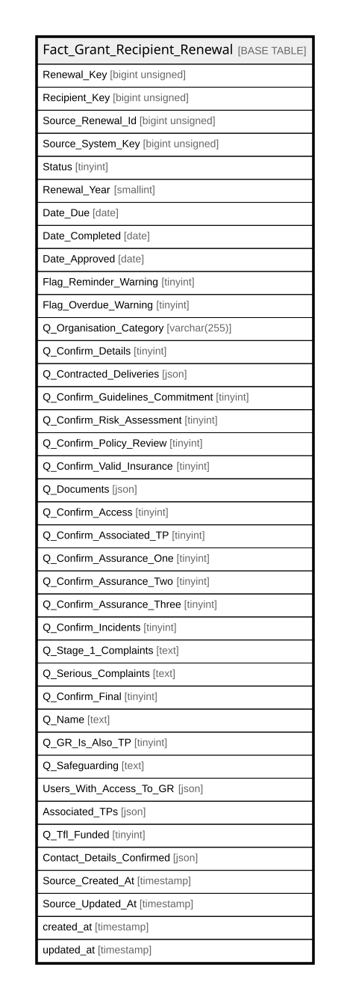

# Fact_Grant_Recipient_Renewal

## Description

<details>
<summary><strong>Table Definition</strong></summary>

```sql
CREATE TABLE `Fact_Grant_Recipient_Renewal` (
  `Renewal_Key` bigint unsigned NOT NULL AUTO_INCREMENT,
  `Recipient_Key` bigint unsigned NOT NULL,
  `Source_Renewal_Id` bigint unsigned NOT NULL,
  `Source_System_Key` bigint unsigned NOT NULL,
  `Status` tinyint NOT NULL,
  `Renewal_Year` smallint NOT NULL,
  `Date_Due` date NOT NULL,
  `Date_Completed` date DEFAULT NULL,
  `Date_Approved` date DEFAULT NULL,
  `Flag_Reminder_Warning` tinyint NOT NULL DEFAULT '0',
  `Flag_Overdue_Warning` tinyint NOT NULL DEFAULT '0',
  `Q_Organisation_Category` varchar(255) COLLATE utf8mb4_unicode_ci DEFAULT NULL,
  `Q_Confirm_Details` tinyint NOT NULL DEFAULT '0',
  `Q_Contracted_Deliveries` json DEFAULT NULL,
  `Q_Confirm_Guidelines_Commitment` tinyint NOT NULL DEFAULT '0',
  `Q_Confirm_Risk_Assessment` tinyint NOT NULL DEFAULT '0',
  `Q_Confirm_Policy_Review` tinyint NOT NULL DEFAULT '0',
  `Q_Confirm_Valid_Insurance` tinyint NOT NULL DEFAULT '0',
  `Q_Documents` json DEFAULT NULL,
  `Q_Confirm_Access` tinyint NOT NULL DEFAULT '0',
  `Q_Confirm_Associated_TP` tinyint NOT NULL DEFAULT '0',
  `Q_Confirm_Assurance_One` tinyint NOT NULL DEFAULT '0',
  `Q_Confirm_Assurance_Two` tinyint NOT NULL DEFAULT '0',
  `Q_Confirm_Assurance_Three` tinyint NOT NULL DEFAULT '0',
  `Q_Confirm_Incidents` tinyint NOT NULL DEFAULT '0',
  `Q_Stage_1_Complaints` text COLLATE utf8mb4_unicode_ci,
  `Q_Serious_Complaints` text COLLATE utf8mb4_unicode_ci,
  `Q_Confirm_Final` tinyint NOT NULL DEFAULT '0',
  `Q_Name` text COLLATE utf8mb4_unicode_ci,
  `Q_GR_Is_Also_TP` tinyint NOT NULL DEFAULT '0',
  `Q_Safeguarding` text COLLATE utf8mb4_unicode_ci,
  `Users_With_Access_To_GR` json DEFAULT NULL,
  `Associated_TPs` json DEFAULT NULL,
  `Q_Tfl_Funded` tinyint DEFAULT NULL,
  `Contact_Details_Confirmed` json DEFAULT NULL,
  `Source_Created_At` timestamp NULL DEFAULT NULL,
  `Source_Updated_At` timestamp NULL DEFAULT NULL,
  `created_at` timestamp NULL DEFAULT NULL,
  `updated_at` timestamp NULL DEFAULT NULL,
  PRIMARY KEY (`Renewal_Key`),
  UNIQUE KEY `fact_grant_recipient_renewal_source_renewal_id_unique` (`Source_Renewal_Id`),
  KEY `fact_grant_recipient_renewal_recipient_key_index` (`Recipient_Key`)
) ENGINE=InnoDB AUTO_INCREMENT=[Redacted by tbls] DEFAULT CHARSET=utf8mb4 COLLATE=utf8mb4_unicode_ci
```

</details>

## Columns

| Name | Type | Default | Nullable | Extra Definition | Children | Parents | Comment |
| ---- | ---- | ------- | -------- | ---------------- | -------- | ------- | ------- |
| Renewal_Key | bigint unsigned |  | false | auto_increment |  |  |  |
| Recipient_Key | bigint unsigned |  | false |  |  |  |  |
| Source_Renewal_Id | bigint unsigned |  | false |  |  |  |  |
| Source_System_Key | bigint unsigned |  | false |  |  |  |  |
| Status | tinyint |  | false |  |  |  |  |
| Renewal_Year | smallint |  | false |  |  |  |  |
| Date_Due | date |  | false |  |  |  |  |
| Date_Completed | date |  | true |  |  |  |  |
| Date_Approved | date |  | true |  |  |  |  |
| Flag_Reminder_Warning | tinyint | 0 | false |  |  |  |  |
| Flag_Overdue_Warning | tinyint | 0 | false |  |  |  |  |
| Q_Organisation_Category | varchar(255) |  | true |  |  |  |  |
| Q_Confirm_Details | tinyint | 0 | false |  |  |  |  |
| Q_Contracted_Deliveries | json |  | true |  |  |  |  |
| Q_Confirm_Guidelines_Commitment | tinyint | 0 | false |  |  |  |  |
| Q_Confirm_Risk_Assessment | tinyint | 0 | false |  |  |  |  |
| Q_Confirm_Policy_Review | tinyint | 0 | false |  |  |  |  |
| Q_Confirm_Valid_Insurance | tinyint | 0 | false |  |  |  |  |
| Q_Documents | json |  | true |  |  |  |  |
| Q_Confirm_Access | tinyint | 0 | false |  |  |  |  |
| Q_Confirm_Associated_TP | tinyint | 0 | false |  |  |  |  |
| Q_Confirm_Assurance_One | tinyint | 0 | false |  |  |  |  |
| Q_Confirm_Assurance_Two | tinyint | 0 | false |  |  |  |  |
| Q_Confirm_Assurance_Three | tinyint | 0 | false |  |  |  |  |
| Q_Confirm_Incidents | tinyint | 0 | false |  |  |  |  |
| Q_Stage_1_Complaints | text |  | true |  |  |  |  |
| Q_Serious_Complaints | text |  | true |  |  |  |  |
| Q_Confirm_Final | tinyint | 0 | false |  |  |  |  |
| Q_Name | text |  | true |  |  |  |  |
| Q_GR_Is_Also_TP | tinyint | 0 | false |  |  |  |  |
| Q_Safeguarding | text |  | true |  |  |  |  |
| Users_With_Access_To_GR | json |  | true |  |  |  |  |
| Associated_TPs | json |  | true |  |  |  |  |
| Q_Tfl_Funded | tinyint |  | true |  |  |  |  |
| Contact_Details_Confirmed | json |  | true |  |  |  |  |
| Source_Created_At | timestamp |  | true |  |  |  |  |
| Source_Updated_At | timestamp |  | true |  |  |  |  |
| created_at | timestamp |  | true |  |  |  |  |
| updated_at | timestamp |  | true |  |  |  |  |

## Constraints

| Name | Type | Definition |
| ---- | ---- | ---------- |
| fact_grant_recipient_renewal_source_renewal_id_unique | UNIQUE | UNIQUE KEY fact_grant_recipient_renewal_source_renewal_id_unique (Source_Renewal_Id) |
| PRIMARY | PRIMARY KEY | PRIMARY KEY (Renewal_Key) |

## Indexes

| Name | Definition |
| ---- | ---------- |
| fact_grant_recipient_renewal_recipient_key_index | KEY fact_grant_recipient_renewal_recipient_key_index (Recipient_Key) USING BTREE |
| PRIMARY | PRIMARY KEY (Renewal_Key) USING BTREE |
| fact_grant_recipient_renewal_source_renewal_id_unique | UNIQUE KEY fact_grant_recipient_renewal_source_renewal_id_unique (Source_Renewal_Id) USING BTREE |

## Relations



---

> Generated by [tbls](https://github.com/k1LoW/tbls)
