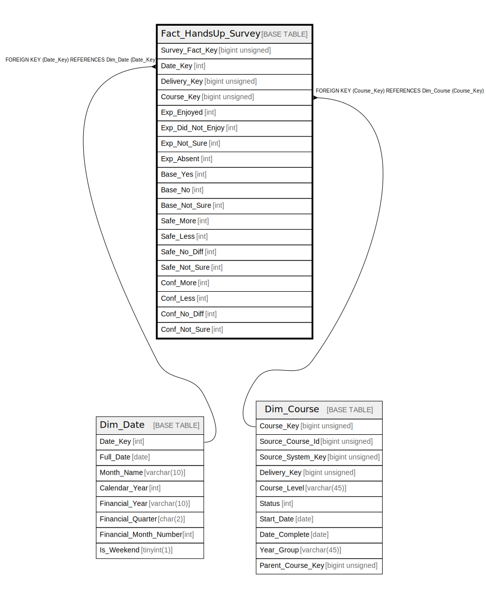

# Fact_HandsUp_Survey

## Description

<details>
<summary><strong>Table Definition</strong></summary>

```sql
CREATE TABLE `Fact_HandsUp_Survey` (
  `Survey_Fact_Key` bigint unsigned NOT NULL AUTO_INCREMENT,
  `Date_Key` int DEFAULT NULL,
  `Delivery_Key` bigint unsigned NOT NULL,
  `Course_Key` bigint unsigned NOT NULL,
  `Exp_Enjoyed` int NOT NULL DEFAULT '0',
  `Exp_Did_Not_Enjoy` int NOT NULL DEFAULT '0',
  `Exp_Not_Sure` int NOT NULL DEFAULT '0',
  `Exp_Absent` int NOT NULL DEFAULT '0',
  `Base_Yes` int NOT NULL DEFAULT '0',
  `Base_No` int NOT NULL DEFAULT '0',
  `Base_Not_Sure` int NOT NULL DEFAULT '0',
  `Safe_More` int NOT NULL DEFAULT '0',
  `Safe_Less` int NOT NULL DEFAULT '0',
  `Safe_No_Diff` int NOT NULL DEFAULT '0',
  `Safe_Not_Sure` int NOT NULL DEFAULT '0',
  `Conf_More` int NOT NULL DEFAULT '0',
  `Conf_Less` int NOT NULL DEFAULT '0',
  `Conf_No_Diff` int NOT NULL DEFAULT '0',
  `Conf_Not_Sure` int NOT NULL DEFAULT '0',
  PRIMARY KEY (`Survey_Fact_Key`),
  KEY `fact_handsup_survey_date_key_foreign` (`Date_Key`),
  KEY `fact_handsup_survey_course_key_foreign` (`Course_Key`),
  CONSTRAINT `fact_handsup_survey_course_key_foreign` FOREIGN KEY (`Course_Key`) REFERENCES `Dim_Course` (`Course_Key`),
  CONSTRAINT `fact_handsup_survey_date_key_foreign` FOREIGN KEY (`Date_Key`) REFERENCES `Dim_Date` (`Date_Key`)
) ENGINE=InnoDB AUTO_INCREMENT=[Redacted by tbls] DEFAULT CHARSET=utf8mb4 COLLATE=utf8mb4_unicode_ci
```

</details>

## Columns

| Name | Type | Default | Nullable | Extra Definition | Children | Parents | Comment |
| ---- | ---- | ------- | -------- | ---------------- | -------- | ------- | ------- |
| Survey_Fact_Key | bigint unsigned |  | false | auto_increment |  |  |  |
| Date_Key | int |  | true |  |  | [Dim_Date](Dim_Date.md) |  |
| Delivery_Key | bigint unsigned |  | false |  |  |  |  |
| Course_Key | bigint unsigned |  | false |  |  | [Dim_Course](Dim_Course.md) |  |
| Exp_Enjoyed | int | 0 | false |  |  |  |  |
| Exp_Did_Not_Enjoy | int | 0 | false |  |  |  |  |
| Exp_Not_Sure | int | 0 | false |  |  |  |  |
| Exp_Absent | int | 0 | false |  |  |  |  |
| Base_Yes | int | 0 | false |  |  |  |  |
| Base_No | int | 0 | false |  |  |  |  |
| Base_Not_Sure | int | 0 | false |  |  |  |  |
| Safe_More | int | 0 | false |  |  |  |  |
| Safe_Less | int | 0 | false |  |  |  |  |
| Safe_No_Diff | int | 0 | false |  |  |  |  |
| Safe_Not_Sure | int | 0 | false |  |  |  |  |
| Conf_More | int | 0 | false |  |  |  |  |
| Conf_Less | int | 0 | false |  |  |  |  |
| Conf_No_Diff | int | 0 | false |  |  |  |  |
| Conf_Not_Sure | int | 0 | false |  |  |  |  |

## Constraints

| Name | Type | Definition |
| ---- | ---- | ---------- |
| fact_handsup_survey_course_key_foreign | FOREIGN KEY | FOREIGN KEY (Course_Key) REFERENCES Dim_Course (Course_Key) |
| fact_handsup_survey_date_key_foreign | FOREIGN KEY | FOREIGN KEY (Date_Key) REFERENCES Dim_Date (Date_Key) |
| PRIMARY | PRIMARY KEY | PRIMARY KEY (Survey_Fact_Key) |

## Indexes

| Name | Definition |
| ---- | ---------- |
| fact_handsup_survey_course_key_foreign | KEY fact_handsup_survey_course_key_foreign (Course_Key) USING BTREE |
| fact_handsup_survey_date_key_foreign | KEY fact_handsup_survey_date_key_foreign (Date_Key) USING BTREE |
| PRIMARY | PRIMARY KEY (Survey_Fact_Key) USING BTREE |

## Relations



---

> Generated by [tbls](https://github.com/k1LoW/tbls)
