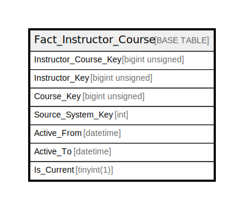

# Fact_Instructor_Course

## Description

<details>
<summary><strong>Table Definition</strong></summary>

```sql
CREATE TABLE `Fact_Instructor_Course` (
  `Instructor_Course_Key` bigint unsigned NOT NULL AUTO_INCREMENT,
  `Instructor_Key` bigint unsigned NOT NULL,
  `Course_Key` bigint unsigned NOT NULL,
  `Source_System_Key` int NOT NULL,
  `Active_From` datetime NOT NULL,
  `Active_To` datetime DEFAULT NULL COMMENT 'Null means currently active',
  `Is_Current` tinyint(1) NOT NULL DEFAULT '1',
  PRIMARY KEY (`Instructor_Course_Key`),
  KEY `fact_instructor_course_instructor_key_is_current_index` (`Instructor_Key`,`Is_Current`),
  KEY `fact_instructor_course_course_key_is_current_index` (`Course_Key`,`Is_Current`)
) ENGINE=InnoDB DEFAULT CHARSET=utf8mb4 COLLATE=utf8mb4_unicode_ci
```

</details>

## Columns

| Name | Type | Default | Nullable | Extra Definition | Children | Parents | Comment |
| ---- | ---- | ------- | -------- | ---------------- | -------- | ------- | ------- |
| Instructor_Course_Key | bigint unsigned |  | false | auto_increment |  |  |  |
| Instructor_Key | bigint unsigned |  | false |  |  |  |  |
| Course_Key | bigint unsigned |  | false |  |  |  |  |
| Source_System_Key | int |  | false |  |  |  |  |
| Active_From | datetime |  | false |  |  |  |  |
| Active_To | datetime |  | true |  |  |  | Null means currently active |
| Is_Current | tinyint(1) | 1 | false |  |  |  |  |

## Constraints

| Name | Type | Definition |
| ---- | ---- | ---------- |
| PRIMARY | PRIMARY KEY | PRIMARY KEY (Instructor_Course_Key) |

## Indexes

| Name | Definition |
| ---- | ---------- |
| fact_instructor_course_course_key_is_current_index | KEY fact_instructor_course_course_key_is_current_index (Course_Key, Is_Current) USING BTREE |
| fact_instructor_course_instructor_key_is_current_index | KEY fact_instructor_course_instructor_key_is_current_index (Instructor_Key, Is_Current) USING BTREE |
| PRIMARY | PRIMARY KEY (Instructor_Course_Key) USING BTREE |

## Relations



---

> Generated by [tbls](https://github.com/k1LoW/tbls)
