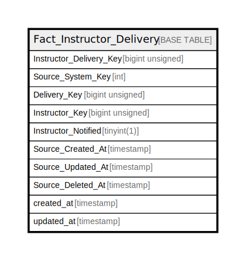

# Fact_Instructor_Delivery

## Description

<details>
<summary><strong>Table Definition</strong></summary>

```sql
CREATE TABLE `Fact_Instructor_Delivery` (
  `Instructor_Delivery_Key` bigint unsigned NOT NULL AUTO_INCREMENT,
  `Source_System_Key` int NOT NULL,
  `Delivery_Key` bigint unsigned NOT NULL,
  `Instructor_Key` bigint unsigned NOT NULL,
  `Instructor_Notified` tinyint(1) NOT NULL DEFAULT '0',
  `Source_Created_At` timestamp NULL DEFAULT NULL,
  `Source_Updated_At` timestamp NULL DEFAULT NULL,
  `Source_Deleted_At` timestamp NULL DEFAULT NULL,
  `created_at` timestamp NULL DEFAULT NULL,
  `updated_at` timestamp NULL DEFAULT NULL,
  PRIMARY KEY (`Instructor_Delivery_Key`),
  KEY `idx_delivery_instructor` (`Delivery_Key`,`Instructor_Key`)
) ENGINE=InnoDB AUTO_INCREMENT=[Redacted by tbls] DEFAULT CHARSET=utf8mb4 COLLATE=utf8mb4_unicode_ci
```

</details>

## Columns

| Name | Type | Default | Nullable | Extra Definition | Children | Parents | Comment |
| ---- | ---- | ------- | -------- | ---------------- | -------- | ------- | ------- |
| Instructor_Delivery_Key | bigint unsigned |  | false | auto_increment |  |  |  |
| Source_System_Key | int |  | false |  |  |  |  |
| Delivery_Key | bigint unsigned |  | false |  |  |  |  |
| Instructor_Key | bigint unsigned |  | false |  |  |  |  |
| Instructor_Notified | tinyint(1) | 0 | false |  |  |  |  |
| Source_Created_At | timestamp |  | true |  |  |  |  |
| Source_Updated_At | timestamp |  | true |  |  |  |  |
| Source_Deleted_At | timestamp |  | true |  |  |  |  |
| created_at | timestamp |  | true |  |  |  |  |
| updated_at | timestamp |  | true |  |  |  |  |

## Constraints

| Name | Type | Definition |
| ---- | ---- | ---------- |
| PRIMARY | PRIMARY KEY | PRIMARY KEY (Instructor_Delivery_Key) |

## Indexes

| Name | Definition |
| ---- | ---------- |
| idx_delivery_instructor | KEY idx_delivery_instructor (Delivery_Key, Instructor_Key) USING BTREE |
| PRIMARY | PRIMARY KEY (Instructor_Delivery_Key) USING BTREE |

## Relations



---

> Generated by [tbls](https://github.com/k1LoW/tbls)
