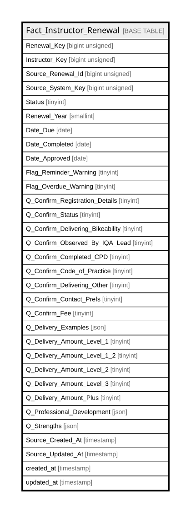

# Fact_Instructor_Renewal

## Description

<details>
<summary><strong>Table Definition</strong></summary>

```sql
CREATE TABLE `Fact_Instructor_Renewal` (
  `Renewal_Key` bigint unsigned NOT NULL AUTO_INCREMENT,
  `Instructor_Key` bigint unsigned NOT NULL,
  `Source_Renewal_Id` bigint unsigned NOT NULL,
  `Source_System_Key` bigint unsigned NOT NULL,
  `Status` tinyint NOT NULL,
  `Renewal_Year` smallint NOT NULL,
  `Date_Due` date NOT NULL,
  `Date_Completed` date DEFAULT NULL,
  `Date_Approved` date DEFAULT NULL,
  `Flag_Reminder_Warning` tinyint NOT NULL DEFAULT '0',
  `Flag_Overdue_Warning` tinyint NOT NULL DEFAULT '0',
  `Q_Confirm_Registration_Details` tinyint NOT NULL DEFAULT '0',
  `Q_Confirm_Status` tinyint DEFAULT '0',
  `Q_Confirm_Delivering_Bikeability` tinyint DEFAULT NULL,
  `Q_Confirm_Observed_By_IQA_Lead` tinyint DEFAULT NULL,
  `Q_Confirm_Completed_CPD` tinyint DEFAULT NULL,
  `Q_Confirm_Code_of_Practice` tinyint DEFAULT NULL,
  `Q_Confirm_Delivering_Other` tinyint DEFAULT '0',
  `Q_Confirm_Contact_Prefs` tinyint NOT NULL DEFAULT '0',
  `Q_Confirm_Fee` tinyint DEFAULT '0',
  `Q_Delivery_Examples` json DEFAULT NULL,
  `Q_Delivery_Amount_Level_1` tinyint DEFAULT '0',
  `Q_Delivery_Amount_Level_1_2` tinyint DEFAULT '0',
  `Q_Delivery_Amount_Level_2` tinyint DEFAULT '0',
  `Q_Delivery_Amount_Level_3` tinyint DEFAULT '0',
  `Q_Delivery_Amount_Plus` tinyint DEFAULT '0',
  `Q_Professional_Development` json DEFAULT NULL,
  `Q_Strengths` json DEFAULT NULL,
  `Source_Created_At` timestamp NULL DEFAULT NULL,
  `Source_Updated_At` timestamp NULL DEFAULT NULL,
  `created_at` timestamp NULL DEFAULT NULL,
  `updated_at` timestamp NULL DEFAULT NULL,
  PRIMARY KEY (`Renewal_Key`),
  UNIQUE KEY `fact_instructor_renewal_source_renewal_id_unique` (`Source_Renewal_Id`),
  KEY `fact_instructor_renewal_instructor_key_index` (`Instructor_Key`)
) ENGINE=InnoDB AUTO_INCREMENT=[Redacted by tbls] DEFAULT CHARSET=utf8mb4 COLLATE=utf8mb4_unicode_ci
```

</details>

## Columns

| Name | Type | Default | Nullable | Extra Definition | Children | Parents | Comment |
| ---- | ---- | ------- | -------- | ---------------- | -------- | ------- | ------- |
| Renewal_Key | bigint unsigned |  | false | auto_increment |  |  |  |
| Instructor_Key | bigint unsigned |  | false |  |  |  |  |
| Source_Renewal_Id | bigint unsigned |  | false |  |  |  |  |
| Source_System_Key | bigint unsigned |  | false |  |  |  |  |
| Status | tinyint |  | false |  |  |  |  |
| Renewal_Year | smallint |  | false |  |  |  |  |
| Date_Due | date |  | false |  |  |  |  |
| Date_Completed | date |  | true |  |  |  |  |
| Date_Approved | date |  | true |  |  |  |  |
| Flag_Reminder_Warning | tinyint | 0 | false |  |  |  |  |
| Flag_Overdue_Warning | tinyint | 0 | false |  |  |  |  |
| Q_Confirm_Registration_Details | tinyint | 0 | false |  |  |  |  |
| Q_Confirm_Status | tinyint | 0 | true |  |  |  |  |
| Q_Confirm_Delivering_Bikeability | tinyint |  | true |  |  |  |  |
| Q_Confirm_Observed_By_IQA_Lead | tinyint |  | true |  |  |  |  |
| Q_Confirm_Completed_CPD | tinyint |  | true |  |  |  |  |
| Q_Confirm_Code_of_Practice | tinyint |  | true |  |  |  |  |
| Q_Confirm_Delivering_Other | tinyint | 0 | true |  |  |  |  |
| Q_Confirm_Contact_Prefs | tinyint | 0 | false |  |  |  |  |
| Q_Confirm_Fee | tinyint | 0 | true |  |  |  |  |
| Q_Delivery_Examples | json |  | true |  |  |  |  |
| Q_Delivery_Amount_Level_1 | tinyint | 0 | true |  |  |  |  |
| Q_Delivery_Amount_Level_1_2 | tinyint | 0 | true |  |  |  |  |
| Q_Delivery_Amount_Level_2 | tinyint | 0 | true |  |  |  |  |
| Q_Delivery_Amount_Level_3 | tinyint | 0 | true |  |  |  |  |
| Q_Delivery_Amount_Plus | tinyint | 0 | true |  |  |  |  |
| Q_Professional_Development | json |  | true |  |  |  |  |
| Q_Strengths | json |  | true |  |  |  |  |
| Source_Created_At | timestamp |  | true |  |  |  |  |
| Source_Updated_At | timestamp |  | true |  |  |  |  |
| created_at | timestamp |  | true |  |  |  |  |
| updated_at | timestamp |  | true |  |  |  |  |

## Constraints

| Name | Type | Definition |
| ---- | ---- | ---------- |
| fact_instructor_renewal_source_renewal_id_unique | UNIQUE | UNIQUE KEY fact_instructor_renewal_source_renewal_id_unique (Source_Renewal_Id) |
| PRIMARY | PRIMARY KEY | PRIMARY KEY (Renewal_Key) |

## Indexes

| Name | Definition |
| ---- | ---------- |
| fact_instructor_renewal_instructor_key_index | KEY fact_instructor_renewal_instructor_key_index (Instructor_Key) USING BTREE |
| PRIMARY | PRIMARY KEY (Renewal_Key) USING BTREE |
| fact_instructor_renewal_source_renewal_id_unique | UNIQUE KEY fact_instructor_renewal_source_renewal_id_unique (Source_Renewal_Id) USING BTREE |

## Relations



---

> Generated by [tbls](https://github.com/k1LoW/tbls)
