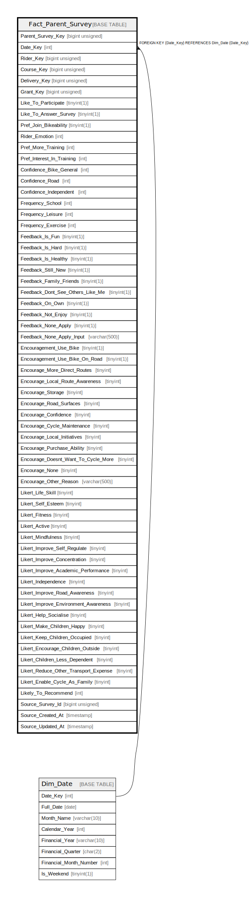

# Fact_Parent_Survey

## Description

<details>
<summary><strong>Table Definition</strong></summary>

```sql
CREATE TABLE `Fact_Parent_Survey` (
  `Parent_Survey_Key` bigint unsigned NOT NULL AUTO_INCREMENT,
  `Date_Key` int NOT NULL,
  `Rider_Key` bigint unsigned NOT NULL,
  `Course_Key` bigint unsigned NOT NULL,
  `Delivery_Key` bigint unsigned NOT NULL,
  `Grant_Key` bigint unsigned DEFAULT NULL,
  `Like_To_Participate` tinyint(1) NOT NULL DEFAULT '0',
  `Like_To_Answer_Survey` tinyint(1) NOT NULL DEFAULT '0',
  `Pref_Join_Bikeability` tinyint(1) NOT NULL DEFAULT '0',
  `Rider_Emotion` int DEFAULT NULL,
  `Pref_More_Training` int DEFAULT NULL,
  `Pref_Interest_In_Training` int DEFAULT NULL,
  `Confidence_Bike_General` int DEFAULT NULL,
  `Confidence_Road` int DEFAULT NULL,
  `Confidence_Independent` int DEFAULT NULL,
  `Frequency_School` int DEFAULT NULL,
  `Frequency_Leisure` int DEFAULT NULL,
  `Frequency_Exercise` int DEFAULT NULL,
  `Feedback_Is_Fun` tinyint(1) NOT NULL DEFAULT '0',
  `Feedback_Is_Hard` tinyint(1) NOT NULL DEFAULT '0',
  `Feedback_Is_Healthy` tinyint(1) NOT NULL DEFAULT '0',
  `Feedback_Still_New` tinyint(1) NOT NULL DEFAULT '0',
  `Feedback_Family_Friends` tinyint(1) NOT NULL DEFAULT '0',
  `Feedback_Dont_See_Others_Like_Me` tinyint(1) NOT NULL DEFAULT '0',
  `Feedback_On_Own` tinyint(1) NOT NULL DEFAULT '0',
  `Feedback_Not_Enjoy` tinyint(1) NOT NULL DEFAULT '0',
  `Feedback_None_Apply` tinyint(1) NOT NULL DEFAULT '0',
  `Feedback_None_Apply_Input` varchar(500) CHARACTER SET utf8mb4 COLLATE utf8mb4_unicode_ci DEFAULT NULL,
  `Encouragement_Use_Bike` tinyint(1) DEFAULT '0',
  `Encouragement_Use_Bike_On_Road` tinyint(1) DEFAULT '0',
  `Encourage_More_Direct_Routes` tinyint DEFAULT '0',
  `Encourage_Local_Route_Awareness` tinyint DEFAULT '0',
  `Encourage_Storage` tinyint DEFAULT '0',
  `Encourage_Road_Surfaces` tinyint DEFAULT '0',
  `Encourage_Confidence` tinyint DEFAULT '0',
  `Encourage_Cycle_Maintenance` tinyint DEFAULT '0',
  `Encourage_Local_Initiatives` tinyint DEFAULT '0',
  `Encourage_Purchase_Ability` tinyint DEFAULT '0',
  `Encourage_Doesnt_Want_To_Cycle_More` tinyint DEFAULT '0',
  `Encourage_None` tinyint DEFAULT '0',
  `Encourage_Other_Reason` varchar(500) CHARACTER SET utf8mb4 COLLATE utf8mb4_unicode_ci DEFAULT NULL,
  `Likert_Life_Skill` tinyint DEFAULT NULL,
  `Likert_Self_Esteem` tinyint DEFAULT NULL,
  `Likert_Fitness` tinyint DEFAULT NULL,
  `Likert_Active` tinyint DEFAULT NULL,
  `Likert_Mindfulness` tinyint DEFAULT NULL,
  `Likert_Improve_Self_Regulate` tinyint DEFAULT NULL,
  `Likert_Improve_Concentration` tinyint DEFAULT NULL,
  `Likert_Improve_Academic_Performance` tinyint DEFAULT NULL,
  `Likert_Independence` tinyint DEFAULT NULL,
  `Likert_Improve_Road_Awareness` tinyint DEFAULT NULL,
  `Likert_Improve_Environment_Awareness` tinyint DEFAULT NULL,
  `Likert_Help_Socialise` tinyint DEFAULT NULL,
  `Likert_Make_Children_Happy` tinyint DEFAULT NULL,
  `Likert_Keep_Children_Occupied` tinyint DEFAULT NULL,
  `Likert_Encourage_Children_Outside` tinyint DEFAULT NULL,
  `Likert_Children_Less_Dependent` tinyint DEFAULT NULL,
  `Likert_Reduce_Other_Transport_Expense` tinyint DEFAULT NULL,
  `Likert_Enable_Cycle_As_Family` tinyint DEFAULT NULL,
  `Likely_To_Recommend` int DEFAULT '0',
  `Source_Survey_Id` bigint unsigned NOT NULL,
  `Source_Created_At` timestamp NULL DEFAULT NULL,
  `Source_Updated_At` timestamp NULL DEFAULT NULL,
  PRIMARY KEY (`Parent_Survey_Key`),
  KEY `fact_parent_survey_date_key_foreign` (`Date_Key`),
  CONSTRAINT `fact_parent_survey_date_key_foreign` FOREIGN KEY (`Date_Key`) REFERENCES `Dim_Date` (`Date_Key`)
) ENGINE=InnoDB AUTO_INCREMENT=[Redacted by tbls] DEFAULT CHARSET=utf8mb4 COLLATE=utf8mb4_unicode_ci
```

</details>

## Columns

| Name | Type | Default | Nullable | Extra Definition | Children | Parents | Comment |
| ---- | ---- | ------- | -------- | ---------------- | -------- | ------- | ------- |
| Parent_Survey_Key | bigint unsigned |  | false | auto_increment |  |  |  |
| Date_Key | int |  | false |  |  | [Dim_Date](Dim_Date.md) |  |
| Rider_Key | bigint unsigned |  | false |  |  |  |  |
| Course_Key | bigint unsigned |  | false |  |  |  |  |
| Delivery_Key | bigint unsigned |  | false |  |  |  |  |
| Grant_Key | bigint unsigned |  | true |  |  |  |  |
| Like_To_Participate | tinyint(1) | 0 | false |  |  |  |  |
| Like_To_Answer_Survey | tinyint(1) | 0 | false |  |  |  |  |
| Pref_Join_Bikeability | tinyint(1) | 0 | false |  |  |  |  |
| Rider_Emotion | int |  | true |  |  |  |  |
| Pref_More_Training | int |  | true |  |  |  |  |
| Pref_Interest_In_Training | int |  | true |  |  |  |  |
| Confidence_Bike_General | int |  | true |  |  |  |  |
| Confidence_Road | int |  | true |  |  |  |  |
| Confidence_Independent | int |  | true |  |  |  |  |
| Frequency_School | int |  | true |  |  |  |  |
| Frequency_Leisure | int |  | true |  |  |  |  |
| Frequency_Exercise | int |  | true |  |  |  |  |
| Feedback_Is_Fun | tinyint(1) | 0 | false |  |  |  |  |
| Feedback_Is_Hard | tinyint(1) | 0 | false |  |  |  |  |
| Feedback_Is_Healthy | tinyint(1) | 0 | false |  |  |  |  |
| Feedback_Still_New | tinyint(1) | 0 | false |  |  |  |  |
| Feedback_Family_Friends | tinyint(1) | 0 | false |  |  |  |  |
| Feedback_Dont_See_Others_Like_Me | tinyint(1) | 0 | false |  |  |  |  |
| Feedback_On_Own | tinyint(1) | 0 | false |  |  |  |  |
| Feedback_Not_Enjoy | tinyint(1) | 0 | false |  |  |  |  |
| Feedback_None_Apply | tinyint(1) | 0 | false |  |  |  |  |
| Feedback_None_Apply_Input | varchar(500) |  | true |  |  |  |  |
| Encouragement_Use_Bike | tinyint(1) | 0 | true |  |  |  |  |
| Encouragement_Use_Bike_On_Road | tinyint(1) | 0 | true |  |  |  |  |
| Encourage_More_Direct_Routes | tinyint | 0 | true |  |  |  |  |
| Encourage_Local_Route_Awareness | tinyint | 0 | true |  |  |  |  |
| Encourage_Storage | tinyint | 0 | true |  |  |  |  |
| Encourage_Road_Surfaces | tinyint | 0 | true |  |  |  |  |
| Encourage_Confidence | tinyint | 0 | true |  |  |  |  |
| Encourage_Cycle_Maintenance | tinyint | 0 | true |  |  |  |  |
| Encourage_Local_Initiatives | tinyint | 0 | true |  |  |  |  |
| Encourage_Purchase_Ability | tinyint | 0 | true |  |  |  |  |
| Encourage_Doesnt_Want_To_Cycle_More | tinyint | 0 | true |  |  |  |  |
| Encourage_None | tinyint | 0 | true |  |  |  |  |
| Encourage_Other_Reason | varchar(500) |  | true |  |  |  |  |
| Likert_Life_Skill | tinyint |  | true |  |  |  |  |
| Likert_Self_Esteem | tinyint |  | true |  |  |  |  |
| Likert_Fitness | tinyint |  | true |  |  |  |  |
| Likert_Active | tinyint |  | true |  |  |  |  |
| Likert_Mindfulness | tinyint |  | true |  |  |  |  |
| Likert_Improve_Self_Regulate | tinyint |  | true |  |  |  |  |
| Likert_Improve_Concentration | tinyint |  | true |  |  |  |  |
| Likert_Improve_Academic_Performance | tinyint |  | true |  |  |  |  |
| Likert_Independence | tinyint |  | true |  |  |  |  |
| Likert_Improve_Road_Awareness | tinyint |  | true |  |  |  |  |
| Likert_Improve_Environment_Awareness | tinyint |  | true |  |  |  |  |
| Likert_Help_Socialise | tinyint |  | true |  |  |  |  |
| Likert_Make_Children_Happy | tinyint |  | true |  |  |  |  |
| Likert_Keep_Children_Occupied | tinyint |  | true |  |  |  |  |
| Likert_Encourage_Children_Outside | tinyint |  | true |  |  |  |  |
| Likert_Children_Less_Dependent | tinyint |  | true |  |  |  |  |
| Likert_Reduce_Other_Transport_Expense | tinyint |  | true |  |  |  |  |
| Likert_Enable_Cycle_As_Family | tinyint |  | true |  |  |  |  |
| Likely_To_Recommend | int | 0 | true |  |  |  |  |
| Source_Survey_Id | bigint unsigned |  | false |  |  |  |  |
| Source_Created_At | timestamp |  | true |  |  |  |  |
| Source_Updated_At | timestamp |  | true |  |  |  |  |

## Constraints

| Name | Type | Definition |
| ---- | ---- | ---------- |
| fact_parent_survey_date_key_foreign | FOREIGN KEY | FOREIGN KEY (Date_Key) REFERENCES Dim_Date (Date_Key) |
| PRIMARY | PRIMARY KEY | PRIMARY KEY (Parent_Survey_Key) |

## Indexes

| Name | Definition |
| ---- | ---------- |
| fact_parent_survey_date_key_foreign | KEY fact_parent_survey_date_key_foreign (Date_Key) USING BTREE |
| PRIMARY | PRIMARY KEY (Parent_Survey_Key) USING BTREE |

## Relations



---

> Generated by [tbls](https://github.com/k1LoW/tbls)
