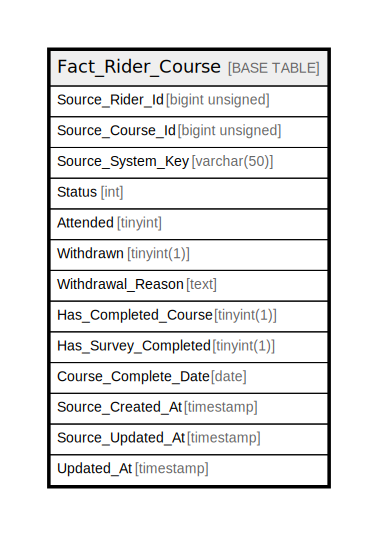

# Fact_Rider_Course

## Description

<details>
<summary><strong>Table Definition</strong></summary>

```sql
CREATE TABLE `Fact_Rider_Course` (
  `Source_Rider_Id` bigint unsigned NOT NULL,
  `Source_Course_Id` bigint unsigned NOT NULL,
  `Source_System_Key` varchar(50) COLLATE utf8mb4_unicode_ci NOT NULL,
  `Status` int NOT NULL DEFAULT '0',
  `Attended` tinyint DEFAULT '1',
  `Withdrawn` tinyint(1) DEFAULT '0',
  `Withdrawal_Reason` text COLLATE utf8mb4_unicode_ci,
  `Has_Completed_Course` tinyint(1) DEFAULT '0',
  `Has_Survey_Completed` tinyint(1) NOT NULL DEFAULT '0',
  `Course_Complete_Date` date DEFAULT NULL,
  `Source_Created_At` timestamp NULL DEFAULT NULL,
  `Source_Updated_At` timestamp NULL DEFAULT NULL,
  `Updated_At` timestamp NOT NULL DEFAULT CURRENT_TIMESTAMP ON UPDATE CURRENT_TIMESTAMP,
  PRIMARY KEY (`Source_Rider_Id`,`Source_Course_Id`),
  KEY `idx_dwh_source_updated` (`Source_Updated_At`)
) ENGINE=InnoDB DEFAULT CHARSET=utf8mb4 COLLATE=utf8mb4_unicode_ci
```

</details>

## Columns

| Name | Type | Default | Nullable | Extra Definition | Children | Parents | Comment |
| ---- | ---- | ------- | -------- | ---------------- | -------- | ------- | ------- |
| Source_Rider_Id | bigint unsigned |  | false |  |  |  |  |
| Source_Course_Id | bigint unsigned |  | false |  |  |  |  |
| Source_System_Key | varchar(50) |  | false |  |  |  |  |
| Status | int | 0 | false |  |  |  |  |
| Attended | tinyint | 1 | true |  |  |  |  |
| Withdrawn | tinyint(1) | 0 | true |  |  |  |  |
| Withdrawal_Reason | text |  | true |  |  |  |  |
| Has_Completed_Course | tinyint(1) | 0 | true |  |  |  |  |
| Has_Survey_Completed | tinyint(1) | 0 | false |  |  |  |  |
| Course_Complete_Date | date |  | true |  |  |  |  |
| Source_Created_At | timestamp |  | true |  |  |  |  |
| Source_Updated_At | timestamp |  | true |  |  |  |  |
| Updated_At | timestamp | CURRENT_TIMESTAMP | false | DEFAULT_GENERATED on update CURRENT_TIMESTAMP |  |  |  |

## Constraints

| Name | Type | Definition |
| ---- | ---- | ---------- |
| PRIMARY | PRIMARY KEY | PRIMARY KEY (Source_Rider_Id, Source_Course_Id) |

## Indexes

| Name | Definition |
| ---- | ---------- |
| idx_dwh_source_updated | KEY idx_dwh_source_updated (Source_Updated_At) USING BTREE |
| PRIMARY | PRIMARY KEY (Source_Rider_Id, Source_Course_Id) USING BTREE |

## Relations



---

> Generated by [tbls](https://github.com/k1LoW/tbls)
