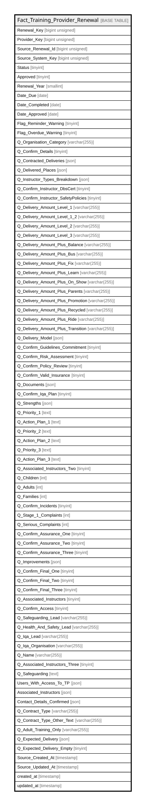

# Fact_Training_Provider_Renewal

## Description

<details>
<summary><strong>Table Definition</strong></summary>

```sql
CREATE TABLE `Fact_Training_Provider_Renewal` (
  `Renewal_Key` bigint unsigned NOT NULL AUTO_INCREMENT,
  `Provider_Key` bigint unsigned NOT NULL COMMENT 'FK to Dim_Training_Provider',
  `Source_Renewal_Id` bigint unsigned NOT NULL,
  `Source_System_Key` bigint unsigned NOT NULL,
  `Status` tinyint NOT NULL,
  `Approved` tinyint DEFAULT NULL,
  `Renewal_Year` smallint NOT NULL,
  `Date_Due` date NOT NULL,
  `Date_Completed` date DEFAULT NULL,
  `Date_Approved` date DEFAULT NULL,
  `Flag_Reminder_Warning` tinyint NOT NULL DEFAULT '0',
  `Flag_Overdue_Warning` tinyint NOT NULL DEFAULT '0',
  `Q_Organisation_Category` varchar(255) COLLATE utf8mb4_unicode_ci DEFAULT NULL,
  `Q_Confirm_Details` tinyint NOT NULL DEFAULT '0',
  `Q_Contracted_Deliveries` json DEFAULT NULL,
  `Q_Delivered_Places` json DEFAULT NULL,
  `Q_Instructor_Types_Breakdown` json DEFAULT NULL,
  `Q_Confirm_Instructor_DbsCert` tinyint NOT NULL DEFAULT '0',
  `Q_Confirm_Instructor_SafetyPolicies` tinyint NOT NULL DEFAULT '0',
  `Q_Delivery_Amount_Level_1` varchar(255) COLLATE utf8mb4_unicode_ci DEFAULT NULL,
  `Q_Delivery_Amount_Level_1_2` varchar(255) COLLATE utf8mb4_unicode_ci DEFAULT NULL,
  `Q_Delivery_Amount_Level_2` varchar(255) COLLATE utf8mb4_unicode_ci DEFAULT NULL,
  `Q_Delivery_Amount_Level_3` varchar(255) COLLATE utf8mb4_unicode_ci DEFAULT NULL,
  `Q_Delivery_Amount_Plus_Balance` varchar(255) COLLATE utf8mb4_unicode_ci DEFAULT NULL,
  `Q_Delivery_Amount_Plus_Bus` varchar(255) COLLATE utf8mb4_unicode_ci DEFAULT NULL,
  `Q_Delivery_Amount_Plus_Fix` varchar(255) COLLATE utf8mb4_unicode_ci DEFAULT NULL,
  `Q_Delivery_Amount_Plus_Learn` varchar(255) COLLATE utf8mb4_unicode_ci DEFAULT NULL,
  `Q_Delivery_Amount_Plus_On_Show` varchar(255) COLLATE utf8mb4_unicode_ci DEFAULT NULL,
  `Q_Delivery_Amount_Plus_Parents` varchar(255) COLLATE utf8mb4_unicode_ci DEFAULT NULL,
  `Q_Delivery_Amount_Plus_Promotion` varchar(255) COLLATE utf8mb4_unicode_ci DEFAULT NULL,
  `Q_Delivery_Amount_Plus_Recycled` varchar(255) COLLATE utf8mb4_unicode_ci DEFAULT NULL,
  `Q_Delivery_Amount_Plus_Ride` varchar(255) COLLATE utf8mb4_unicode_ci DEFAULT NULL,
  `Q_Delivery_Amount_Plus_Transition` varchar(255) COLLATE utf8mb4_unicode_ci DEFAULT NULL,
  `Q_Delivery_Model` json DEFAULT NULL,
  `Q_Confirm_Guidelines_Commitment` tinyint NOT NULL DEFAULT '0',
  `Q_Confirm_Risk_Assessment` tinyint NOT NULL DEFAULT '0',
  `Q_Confirm_Policy_Review` tinyint NOT NULL DEFAULT '0',
  `Q_Confirm_Valid_Insurance` tinyint NOT NULL DEFAULT '0',
  `Q_Documents` json DEFAULT NULL,
  `Q_Confirm_Iqa_Plan` tinyint NOT NULL DEFAULT '0',
  `Q_Strengths` json DEFAULT NULL,
  `Q_Priority_1` text COLLATE utf8mb4_unicode_ci,
  `Q_Action_Plan_1` text COLLATE utf8mb4_unicode_ci,
  `Q_Priority_2` text COLLATE utf8mb4_unicode_ci,
  `Q_Action_Plan_2` text COLLATE utf8mb4_unicode_ci,
  `Q_Priority_3` text COLLATE utf8mb4_unicode_ci,
  `Q_Action_Plan_3` text COLLATE utf8mb4_unicode_ci,
  `Q_Associated_Instructors_Two` tinyint NOT NULL DEFAULT '0',
  `Q_Children` int NOT NULL DEFAULT '0',
  `Q_Adults` int NOT NULL DEFAULT '0',
  `Q_Families` int NOT NULL DEFAULT '0',
  `Q_Confirm_Incidents` tinyint NOT NULL DEFAULT '0',
  `Q_Stage_1_Complaints` int NOT NULL DEFAULT '0',
  `Q_Serious_Complaints` int NOT NULL DEFAULT '0',
  `Q_Confirm_Assurance_One` tinyint NOT NULL DEFAULT '0',
  `Q_Confirm_Assurance_Two` tinyint NOT NULL DEFAULT '0',
  `Q_Confirm_Assurance_Three` tinyint NOT NULL DEFAULT '0',
  `Q_Improvements` json DEFAULT NULL,
  `Q_Confirm_Final_One` tinyint NOT NULL DEFAULT '0',
  `Q_Confirm_Final_Two` tinyint NOT NULL DEFAULT '0',
  `Q_Confirm_Final_Three` tinyint NOT NULL DEFAULT '0',
  `Q_Associated_Instructors` tinyint NOT NULL DEFAULT '0',
  `Q_Confirm_Access` tinyint NOT NULL DEFAULT '0',
  `Q_Safeguarding_Lead` varchar(255) COLLATE utf8mb4_unicode_ci DEFAULT NULL,
  `Q_Health_And_Safety_Lead` varchar(255) COLLATE utf8mb4_unicode_ci DEFAULT NULL,
  `Q_Iqa_Lead` varchar(255) COLLATE utf8mb4_unicode_ci DEFAULT NULL,
  `Q_Iqa_Organisation` varchar(255) COLLATE utf8mb4_unicode_ci DEFAULT NULL,
  `Q_Name` varchar(255) COLLATE utf8mb4_unicode_ci DEFAULT NULL,
  `Q_Associated_Instructors_Three` tinyint DEFAULT '0',
  `Q_Safeguarding` text COLLATE utf8mb4_unicode_ci,
  `Users_With_Access_To_TP` json DEFAULT NULL,
  `Associated_Instructors` json DEFAULT NULL,
  `Contact_Details_Confirmed` json DEFAULT NULL,
  `Q_Contract_Type` varchar(255) COLLATE utf8mb4_unicode_ci DEFAULT NULL,
  `Q_Contract_Type_Other_Text` varchar(255) COLLATE utf8mb4_unicode_ci DEFAULT NULL,
  `Q_Adult_Training_Only` varchar(255) COLLATE utf8mb4_unicode_ci DEFAULT NULL,
  `Q_Expected_Delivery` json DEFAULT NULL,
  `Q_Expected_Delivery_Empty` tinyint NOT NULL DEFAULT '0',
  `Source_Created_At` timestamp NULL DEFAULT NULL,
  `Source_Updated_At` timestamp NULL DEFAULT NULL,
  `created_at` timestamp NULL DEFAULT NULL,
  `updated_at` timestamp NULL DEFAULT NULL,
  PRIMARY KEY (`Renewal_Key`),
  UNIQUE KEY `fact_training_provider_renewal_source_renewal_id_unique` (`Source_Renewal_Id`),
  KEY `fact_training_provider_renewal_provider_key_index` (`Provider_Key`)
) ENGINE=InnoDB AUTO_INCREMENT=[Redacted by tbls] DEFAULT CHARSET=utf8mb4 COLLATE=utf8mb4_unicode_ci
```

</details>

## Columns

| Name | Type | Default | Nullable | Extra Definition | Children | Parents | Comment |
| ---- | ---- | ------- | -------- | ---------------- | -------- | ------- | ------- |
| Renewal_Key | bigint unsigned |  | false | auto_increment |  |  |  |
| Provider_Key | bigint unsigned |  | false |  |  |  | FK to Dim_Training_Provider |
| Source_Renewal_Id | bigint unsigned |  | false |  |  |  |  |
| Source_System_Key | bigint unsigned |  | false |  |  |  |  |
| Status | tinyint |  | false |  |  |  |  |
| Approved | tinyint |  | true |  |  |  |  |
| Renewal_Year | smallint |  | false |  |  |  |  |
| Date_Due | date |  | false |  |  |  |  |
| Date_Completed | date |  | true |  |  |  |  |
| Date_Approved | date |  | true |  |  |  |  |
| Flag_Reminder_Warning | tinyint | 0 | false |  |  |  |  |
| Flag_Overdue_Warning | tinyint | 0 | false |  |  |  |  |
| Q_Organisation_Category | varchar(255) |  | true |  |  |  |  |
| Q_Confirm_Details | tinyint | 0 | false |  |  |  |  |
| Q_Contracted_Deliveries | json |  | true |  |  |  |  |
| Q_Delivered_Places | json |  | true |  |  |  |  |
| Q_Instructor_Types_Breakdown | json |  | true |  |  |  |  |
| Q_Confirm_Instructor_DbsCert | tinyint | 0 | false |  |  |  |  |
| Q_Confirm_Instructor_SafetyPolicies | tinyint | 0 | false |  |  |  |  |
| Q_Delivery_Amount_Level_1 | varchar(255) |  | true |  |  |  |  |
| Q_Delivery_Amount_Level_1_2 | varchar(255) |  | true |  |  |  |  |
| Q_Delivery_Amount_Level_2 | varchar(255) |  | true |  |  |  |  |
| Q_Delivery_Amount_Level_3 | varchar(255) |  | true |  |  |  |  |
| Q_Delivery_Amount_Plus_Balance | varchar(255) |  | true |  |  |  |  |
| Q_Delivery_Amount_Plus_Bus | varchar(255) |  | true |  |  |  |  |
| Q_Delivery_Amount_Plus_Fix | varchar(255) |  | true |  |  |  |  |
| Q_Delivery_Amount_Plus_Learn | varchar(255) |  | true |  |  |  |  |
| Q_Delivery_Amount_Plus_On_Show | varchar(255) |  | true |  |  |  |  |
| Q_Delivery_Amount_Plus_Parents | varchar(255) |  | true |  |  |  |  |
| Q_Delivery_Amount_Plus_Promotion | varchar(255) |  | true |  |  |  |  |
| Q_Delivery_Amount_Plus_Recycled | varchar(255) |  | true |  |  |  |  |
| Q_Delivery_Amount_Plus_Ride | varchar(255) |  | true |  |  |  |  |
| Q_Delivery_Amount_Plus_Transition | varchar(255) |  | true |  |  |  |  |
| Q_Delivery_Model | json |  | true |  |  |  |  |
| Q_Confirm_Guidelines_Commitment | tinyint | 0 | false |  |  |  |  |
| Q_Confirm_Risk_Assessment | tinyint | 0 | false |  |  |  |  |
| Q_Confirm_Policy_Review | tinyint | 0 | false |  |  |  |  |
| Q_Confirm_Valid_Insurance | tinyint | 0 | false |  |  |  |  |
| Q_Documents | json |  | true |  |  |  |  |
| Q_Confirm_Iqa_Plan | tinyint | 0 | false |  |  |  |  |
| Q_Strengths | json |  | true |  |  |  |  |
| Q_Priority_1 | text |  | true |  |  |  |  |
| Q_Action_Plan_1 | text |  | true |  |  |  |  |
| Q_Priority_2 | text |  | true |  |  |  |  |
| Q_Action_Plan_2 | text |  | true |  |  |  |  |
| Q_Priority_3 | text |  | true |  |  |  |  |
| Q_Action_Plan_3 | text |  | true |  |  |  |  |
| Q_Associated_Instructors_Two | tinyint | 0 | false |  |  |  |  |
| Q_Children | int | 0 | false |  |  |  |  |
| Q_Adults | int | 0 | false |  |  |  |  |
| Q_Families | int | 0 | false |  |  |  |  |
| Q_Confirm_Incidents | tinyint | 0 | false |  |  |  |  |
| Q_Stage_1_Complaints | int | 0 | false |  |  |  |  |
| Q_Serious_Complaints | int | 0 | false |  |  |  |  |
| Q_Confirm_Assurance_One | tinyint | 0 | false |  |  |  |  |
| Q_Confirm_Assurance_Two | tinyint | 0 | false |  |  |  |  |
| Q_Confirm_Assurance_Three | tinyint | 0 | false |  |  |  |  |
| Q_Improvements | json |  | true |  |  |  |  |
| Q_Confirm_Final_One | tinyint | 0 | false |  |  |  |  |
| Q_Confirm_Final_Two | tinyint | 0 | false |  |  |  |  |
| Q_Confirm_Final_Three | tinyint | 0 | false |  |  |  |  |
| Q_Associated_Instructors | tinyint | 0 | false |  |  |  |  |
| Q_Confirm_Access | tinyint | 0 | false |  |  |  |  |
| Q_Safeguarding_Lead | varchar(255) |  | true |  |  |  |  |
| Q_Health_And_Safety_Lead | varchar(255) |  | true |  |  |  |  |
| Q_Iqa_Lead | varchar(255) |  | true |  |  |  |  |
| Q_Iqa_Organisation | varchar(255) |  | true |  |  |  |  |
| Q_Name | varchar(255) |  | true |  |  |  |  |
| Q_Associated_Instructors_Three | tinyint | 0 | true |  |  |  |  |
| Q_Safeguarding | text |  | true |  |  |  |  |
| Users_With_Access_To_TP | json |  | true |  |  |  |  |
| Associated_Instructors | json |  | true |  |  |  |  |
| Contact_Details_Confirmed | json |  | true |  |  |  |  |
| Q_Contract_Type | varchar(255) |  | true |  |  |  |  |
| Q_Contract_Type_Other_Text | varchar(255) |  | true |  |  |  |  |
| Q_Adult_Training_Only | varchar(255) |  | true |  |  |  |  |
| Q_Expected_Delivery | json |  | true |  |  |  |  |
| Q_Expected_Delivery_Empty | tinyint | 0 | false |  |  |  |  |
| Source_Created_At | timestamp |  | true |  |  |  |  |
| Source_Updated_At | timestamp |  | true |  |  |  |  |
| created_at | timestamp |  | true |  |  |  |  |
| updated_at | timestamp |  | true |  |  |  |  |

## Constraints

| Name | Type | Definition |
| ---- | ---- | ---------- |
| fact_training_provider_renewal_source_renewal_id_unique | UNIQUE | UNIQUE KEY fact_training_provider_renewal_source_renewal_id_unique (Source_Renewal_Id) |
| PRIMARY | PRIMARY KEY | PRIMARY KEY (Renewal_Key) |

## Indexes

| Name | Definition |
| ---- | ---------- |
| fact_training_provider_renewal_provider_key_index | KEY fact_training_provider_renewal_provider_key_index (Provider_Key) USING BTREE |
| PRIMARY | PRIMARY KEY (Renewal_Key) USING BTREE |
| fact_training_provider_renewal_source_renewal_id_unique | UNIQUE KEY fact_training_provider_renewal_source_renewal_id_unique (Source_Renewal_Id) USING BTREE |

## Relations



---

> Generated by [tbls](https://github.com/k1LoW/tbls)
