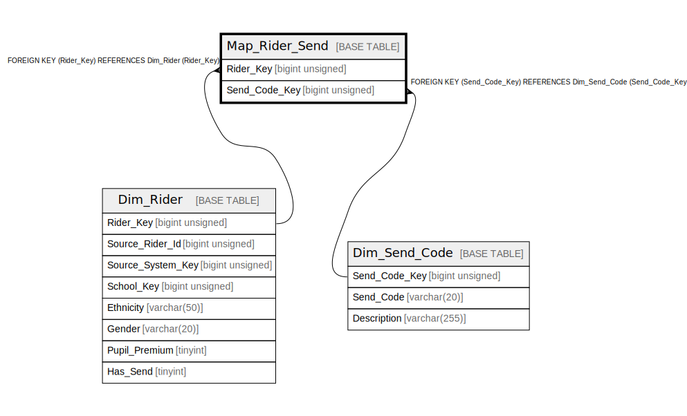

# Map_Rider_Send

## Description

<details>
<summary><strong>Table Definition</strong></summary>

```sql
CREATE TABLE `Map_Rider_Send` (
  `Rider_Key` bigint unsigned NOT NULL,
  `Send_Code_Key` bigint unsigned NOT NULL,
  PRIMARY KEY (`Rider_Key`,`Send_Code_Key`),
  KEY `map_rider_send_send_code_key_foreign` (`Send_Code_Key`),
  CONSTRAINT `map_rider_send_rider_key_foreign` FOREIGN KEY (`Rider_Key`) REFERENCES `Dim_Rider` (`Rider_Key`) ON DELETE CASCADE,
  CONSTRAINT `map_rider_send_send_code_key_foreign` FOREIGN KEY (`Send_Code_Key`) REFERENCES `Dim_Send_Code` (`Send_Code_Key`)
) ENGINE=InnoDB DEFAULT CHARSET=utf8mb4 COLLATE=utf8mb4_unicode_ci
```

</details>

## Columns

| Name | Type | Default | Nullable | Children | Parents | Comment |
| ---- | ---- | ------- | -------- | -------- | ------- | ------- |
| Rider_Key | bigint unsigned |  | false |  | [Dim_Rider](Dim_Rider.md) |  |
| Send_Code_Key | bigint unsigned |  | false |  | [Dim_Send_Code](Dim_Send_Code.md) |  |

## Constraints

| Name | Type | Definition |
| ---- | ---- | ---------- |
| map_rider_send_rider_key_foreign | FOREIGN KEY | FOREIGN KEY (Rider_Key) REFERENCES Dim_Rider (Rider_Key) |
| map_rider_send_send_code_key_foreign | FOREIGN KEY | FOREIGN KEY (Send_Code_Key) REFERENCES Dim_Send_Code (Send_Code_Key) |
| PRIMARY | PRIMARY KEY | PRIMARY KEY (Rider_Key, Send_Code_Key) |

## Indexes

| Name | Definition |
| ---- | ---------- |
| map_rider_send_send_code_key_foreign | KEY map_rider_send_send_code_key_foreign (Send_Code_Key) USING BTREE |
| PRIMARY | PRIMARY KEY (Rider_Key, Send_Code_Key) USING BTREE |

## Relations



---

> Generated by [tbls](https://github.com/k1LoW/tbls)
