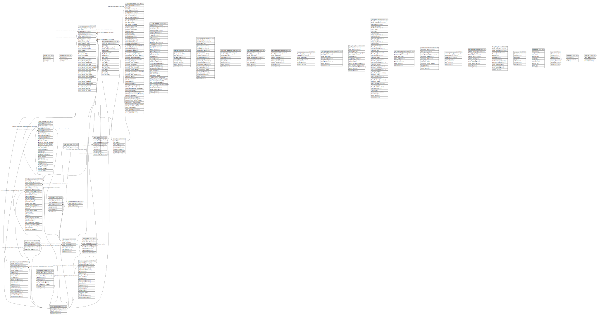

# link-dwh

## Tables

| Name | Columns | Comment | Type |
| ---- | ------- | ------- | ---- |
| [cache](cache.md) | 3 |  | BASE TABLE |
| [cache_locks](cache_locks.md) | 3 |  | BASE TABLE |
| [Dim_Consent](Dim_Consent.md) | 28 |  | BASE TABLE |
| [Dim_Course](Dim_Course.md) | 10 |  | BASE TABLE |
| [Dim_Date](Dim_Date.md) | 8 |  | BASE TABLE |
| [Dim_Delivery_Header](Dim_Delivery_Header.md) | 29 |  | BASE TABLE |
| [Dim_External_Systems](Dim_External_Systems.md) | 10 |  | BASE TABLE |
| [Dim_Grant](Dim_Grant.md) | 8 |  | BASE TABLE |
| [Dim_Grant_Recipient](Dim_Grant_Recipient.md) | 21 |  | BASE TABLE |
| [Dim_Instructor](Dim_Instructor.md) | 40 |  | BASE TABLE |
| [Dim_Organisation](Dim_Organisation.md) | 5 |  | BASE TABLE |
| [Dim_Rider](Dim_Rider.md) | 8 |  | BASE TABLE |
| [Dim_School](Dim_School.md) | 7 |  | BASE TABLE |
| [Dim_Send_Code](Dim_Send_Code.md) | 3 |  | BASE TABLE |
| [Dim_Source_System](Dim_Source_System.md) | 4 |  | BASE TABLE |
| [Dim_Training_Provider](Dim_Training_Provider.md) | 20 |  | BASE TABLE |
| [Dwh_Api_Consumers](Dwh_Api_Consumers.md) | 9 |  | BASE TABLE |
| [Fact_Course_Delivery](Fact_Course_Delivery.md) | 37 |  | BASE TABLE |
| [Fact_Follow_Up_Survey](Fact_Follow_Up_Survey.md) | 23 |  | BASE TABLE |
| [Fact_Grant_Amendment_Logs](Fact_Grant_Amendment_Logs.md) | 9 |  | BASE TABLE |
| [Fact_Grant_Amendments](Fact_Grant_Amendments.md) | 9 |  | BASE TABLE |
| [Fact_Grant_Claim_Inclusions](Fact_Grant_Claim_Inclusions.md) | 9 |  | BASE TABLE |
| [Fact_Grant_Claim_Logs](Fact_Grant_Claim_Logs.md) | 7 |  | BASE TABLE |
| [Fact_Grant_Claim_Send_Records](Fact_Grant_Claim_Send_Records.md) | 8 |  | BASE TABLE |
| [Fact_Grant_Claims](Fact_Grant_Claims.md) | 14 |  | BASE TABLE |
| [Fact_Grant_Financials](Fact_Grant_Financials.md) | 45 |  | BASE TABLE |
| [Fact_Grant_Reallocation_Logs](Fact_Grant_Reallocation_Logs.md) | 8 |  | BASE TABLE |
| [Fact_Grant_Reallocations](Fact_Grant_Reallocations.md) | 12 |  | BASE TABLE |
| [Fact_HandsUp_Survey](Fact_HandsUp_Survey.md) | 19 |  | BASE TABLE |
| [Fact_Instructor_Course](Fact_Instructor_Course.md) | 7 |  | BASE TABLE |
| [Fact_Instructor_Delivery](Fact_Instructor_Delivery.md) | 10 |  | BASE TABLE |
| [Fact_Parent_Survey](Fact_Parent_Survey.md) | 63 |  | BASE TABLE |
| [Fact_Rider_Course](Fact_Rider_Course.md) | 13 |  | BASE TABLE |
| [failed_jobs](failed_jobs.md) | 7 |  | BASE TABLE |
| [job_batches](job_batches.md) | 10 |  | BASE TABLE |
| [jobs](jobs.md) | 7 |  | BASE TABLE |
| [Map_Rider_Send](Map_Rider_Send.md) | 2 |  | BASE TABLE |
| [migrations](migrations.md) | 3 |  | BASE TABLE |
| [Sync_Log](Sync_Log.md) | 3 |  | BASE TABLE |

## Relations

---

> Generated by [tbls](https://github.com/k1LoW/tbls)
