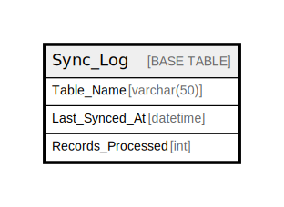

# Sync_Log

## Description

<details>
<summary><strong>Table Definition</strong></summary>

```sql
CREATE TABLE `Sync_Log` (
  `Table_Name` varchar(50) CHARACTER SET utf8mb4 COLLATE utf8mb4_unicode_ci NOT NULL,
  `Last_Synced_At` datetime DEFAULT NULL,
  `Records_Processed` int DEFAULT NULL,
  PRIMARY KEY (`Table_Name`)
) ENGINE=InnoDB DEFAULT CHARSET=utf8mb4 COLLATE=utf8mb4_unicode_ci
```

</details>

## Columns

| Name | Type | Default | Nullable | Children | Parents | Comment |
| ---- | ---- | ------- | -------- | -------- | ------- | ------- |
| Table_Name | varchar(50) |  | false |  |  |  |
| Last_Synced_At | datetime |  | true |  |  |  |
| Records_Processed | int |  | true |  |  |  |

## Constraints

| Name | Type | Definition |
| ---- | ---- | ---------- |
| PRIMARY | PRIMARY KEY | PRIMARY KEY (Table_Name) |

## Indexes

| Name | Definition |
| ---- | ---------- |
| PRIMARY | PRIMARY KEY (Table_Name) USING BTREE |

## Relations



---

> Generated by [tbls](https://github.com/k1LoW/tbls)
